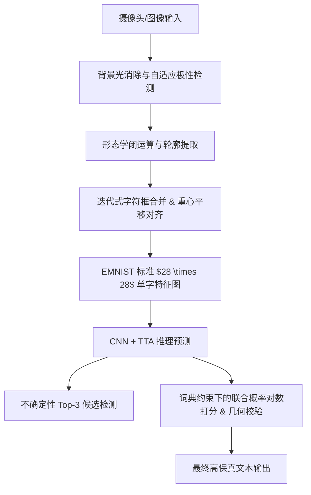

# 基于卷积神经网络的高性能手写体字符识别与智能纠错系统
(High-Performance Convolutional Neural Network-Based Handwritten Character Recognition and Intelligent Correction System)

[简体中文](README.md) | [English](README_EN.md) | [日本語](README_JA.md)

---

## 🌟 1. 系统全景介绍与核心技术指标

本系统是一个端到端、工业级鲁棒的手写体字符识别（OCR）与智能文本纠错系统。系统基于自定义卷积神经网络（CNN）提取字符形体特征，并在前端图像获取、字符空间分割、神经网络推理优化、后处理语言模型纠错以及人机交互五个核心维度进行了深度的算法升级与架构重构。

### 核心功能亮点
* **高鲁棒性预处理**：首创背景光差分补偿去阴影算法，自动适应各类不均匀环境光照；引入自适应对比度极性检测，实现黑白板书/彩纸字迹自动适应。
* **高精度空间分割**：利用形态学闭运算对二值化笔画进行物理桥接，结合迭代式多轮边界框合并算法与重心矩平移对齐，解决连笔、断笔以及 `i`、`j` 等多构件字母被切分的难题。
* **端到端加速推理**：底层维持 3 层卷积块的 `HandwrittenCNN` 模型，网络层采用更平滑的 SiLU (Swish) 激活函数及 Kaiming 权重初始化，推理阶段引入测试时增强（TTA）多采样融合及模型预热，彻底消除首次推理延迟。
* **联合概率拼写纠错**：设计基于最大后验概率（MAP）的词典对数似然打分算法，结合高宽比几何校验与行内相对高度比校验，对易混淆字符对（如 `0/O`、`1/I/l`、`2/Z`、大小写）进行全局多模态纠错。
* **高帧率异步UI工作台**：采用 Tkinter 构建响应式单窗口仪表盘，集成 ThreadPoolExecutor 异步计算图，保证摄像头 30 FPS 实时更新与后台推理任务完美解耦，支持实时与定格模式一键切换。

---

## 🛠️ 2. 数学建模与核心算法创新

系统的数据处理与计算流水线如下图所示：



### 2.1 图像预处理与自适应环境融合

#### 2.1.1 背景光消除差分算法
在真实摄像头拍摄场景下，手部投影或手机阴影会导致常规二值化算法产生大面积黑斑。本系统构建了**背景光消除差分算法**。首先通过一个大核高斯滤波器估算局部区域的背景照度分布图（Illumination Map），接着通过矩阵除法运算消除阴影，使笔画部分对比度极大增强。

其数学模型表示为：
$$\text{Gray}_{\text{no\_shadow}}(x, y) = \min \left( \frac{\text{Gray}(x, y)}{G_{\sigma}(x, y) * \text{Gray}(x, y)} \times 255, 255 \right)$$
其中 $G_{\sigma}$ 为标准差 $\sigma = 51$ 的高斯平滑核，整个除法操作利用 OpenCV 的 `cv2.divide` 矩阵并行执行，能够有效还原出不受光照影响的白底黑字笔画。

#### 2.1.2 自适应对比度极性检测
为了免去用户手动切换“亮底暗字（纸张书写）”与“暗底亮字（黑板板书）”的麻烦，系统会在二值化后自动提取图像边缘的特征像素：
$$\Gamma = \text{Border}(\text{Thresh})$$
统计边缘像素强度的期望值 $E[\Gamma]$。当 $E[\Gamma] > 127$ 时，判定背景为白色，此时为使字符特征契合神经网络的输入分布，将图像进行取反操作：
$$\text{Thresh}_{\text{input}}(x, y) = 255 - \text{Thresh}(x, y)$$
否则，直接保持原样输入。该方法赋予了系统在黑板、彩纸、白板等多种复杂板书媒介下的零配置自适应能力。

---

### 2.2 字符空间分割与重心对齐

#### 2.2.1 形态学闭运算笔画桥接
由于书写工具（如 0.5mm 细签字笔）用力不均或二值化分割阈值限制，字符笔画往往会出现肉眼可见的微小断裂。直接寻找轮廓会导致一个字符被切碎。系统在提取轮廓前，对二值图先应用一个 $2 \times 2$ 矩形结构元 $S$ 执行**闭运算（Closing Operation）**：
$$\text{Closed} = (\text{Thresh} \oplus S) \ominus S$$
该操作能够有效填补笔画内部的细小孔洞，并桥接小于 2 像素的笔画断裂，显著提高了连贯笔画的提取率。

#### 2.2.2 迭代式边界框合并（Box Merging）
常规字符分割只采用单次顺序扫描合并，极易遗漏不相邻的笔画碎片。本系统设计了**基于多轮迭代的边界框合并算法**，通过自适应启发式准则 `should_merge(box1, box2)` 重复迭代，直到框数量收敛。
两框 $B_1(x_1, y_1, w_1, h_1)$ 与 $B_2(x_2, y_2, w_2, h_2)$ 合并的决策准则如下：
1. **嵌套包含检测**：若一框几乎完全内嵌于另一框（容差 $\delta = 3$），则融为一体。
2. **垂直方向重组（解决字母 `i`、`j` 散件问题）**：计算 $B_1$ 与 $B_2$ 在 X 轴上的重叠投影宽度占其最小宽度的比例 $O_x$。若 $O_x > 0.4$，且垂直间距 $\Delta y$ 满足：
   $$\Delta y < \max(15, \min(h_1, h_2) \times 1.8)$$
   并且合并后的总高度不超过两框最大高度的 2.2 倍，则判定为字母与其上方圆点，执行合并。
3. **水平邻近合并（解决手写断笔问题）**：当两框垂直重叠比例 $O_y > 0.5$ 时，若水平间距 $\Delta x \le 3$ 像素，或者间距 $\Delta x \le 6$ 且其中一个框的宽度极窄（宽度 $\le 5$ 像素，视为笔画残缺碎片），则触发水平合并。

#### 2.2.3 重心矩平移对齐（EMNIST 特征对齐）
为消除书写字符在边界框内部偏置对预测准确率的影响，系统不采用简单的居中缩放，而是基于**图像物理矩（Image Moments）**进行精细平移。
首先计算字符二值切图的零阶矩 $M_{00}$ 和一阶矩 $M_{10}, M_{01}$：
$$M_{pq} = \sum_{x} \sum_{y} x^p y^q I(x, y)$$
得到物理重心坐标：
$$x_c = \frac{M_{10}}{M_{00}}, \quad y_c = \frac{M_{01}}{M_{00}}$$
将缩放至 $20 \times 20$ 的字符图像放置在 $28 \times 28$ 的标准白基画布上，计算其物理重心与画布几何中心 $(14, 14)$ 的位移向量：
$$[\Delta x_s, \Delta y_s] = [14.0 - x_c, 14.0 - y_c]$$
应用仿射矩阵将图像平移对齐，极大程度消除了手写体带来的平移噪声。

---

### 2.3 神经网络模型与推理优化

#### 2.3.1 HandwrittenCNN 模型架构
模型共包含 3 个卷积块，采用先池化后保持通道特征的设计，具体网络结构参数如下表所示：

| 阶段 | 层类型 | 输入尺寸 | 输出尺寸 | 参数/配置 |
| :--- | :--- | :--- | :--- | :--- |
| **卷积块 1** | Conv2d + BatchNorm2d + SiLU | $1 \times 28 \times 28$ | $32 \times 28 \times 28$ | $K=3$, $P=1$, $S=1$ |
| | MaxPool2d + Dropout2d | $32 \times 28 \times 28$ | $32 \times 14 \times 14$ | $Pool=2 \times 2$, $Drop=0.15$ |
| **卷积块 2** | Conv2d + BatchNorm2d + SiLU | $32 \times 14 \times 14$ | $64 \times 14 \times 14$ | $K=3$, $P=1$, $S=1$ |
| | MaxPool2d + Dropout2d | $64 \times 14 \times 14$ | $64 \times 7 \times 7$ | $Pool=2 \times 2$, $Drop=0.15$ |
| **卷积块 3** | Conv2d + BatchNorm2d + SiLU | $64 \times 7 \times 7$ | $128 \times 7 \times 7$ | $K=3$, $P=1$, $S=1$（无池化） |
| **全连接层** | Flatten + Linear + SiLU + Dropout | 6272 | 512 | $Drop=0.5$ |
| **输出层** | Linear | 512 | 62 | 对应 EMNIST 62 类字符 |

#### 2.3.2 Kaiming Normal 权重初始化
为防止深层网络在训练初期梯度消失，提升拟合速度，模型对所有卷积层采用了 Kaiming（He）初始化：
$$W \sim \mathcal{N}\left(0, \sqrt{\frac{2}{\text{fan\_in}}}\right)$$
全连接层使用均值为 0、标准差为 0.01 的正态分布初始化，偏置全部清零。

#### 2.3.3 测试时增强（TTA, Test-Time Augmentation）推理
在测试阶段，为了对抗由于手写笔画抖动带来的单个样本预测偏差，系统引入了 TTA 多变体并行采样融合机制。
对于任意单字输入 $x$，模型不仅预测其标准图像，还利用空间变换生成 11 个扰动变体：
* 包含 $\Delta x, \Delta y \in \{-1, 0, 1\}$ 的 9 个平移采样。
* 包含旋转角度 $\theta \in \{-5^{\circ}, 5^{\circ}\}$ 的 2 个仿射旋转采样。

通过在 Batch 维度将这 11 个变体合并送入模型，求取 Softmax 概率均值：
$$P_{\text{TTA}}(y \mid x) = \frac{1}{11} \sum_{k=1}^{11} P_{\text{model}}(y \mid \text{Transform}_k(x))$$
通过此种测试时集成机制，有效平滑了噪声，使分类器的拓扑泛化能力大幅提高。

---

### 2.4 多维度智能纠错后处理模块

#### 2.4.1 基于最大后验概率（MAP）的词典对数似然打分
手写相似字（如单词 `hello` 极易被 CNN 错识别为 `he11O`）是纯视觉识别的瓶颈。本系统在语言层面上，设计了联合概率词典解码算法。当检测到序列处于英文文脉中时，在长度匹配的 10,000 个常用英文单词集合 $D_L$ 中进行穷举打分。

目标是寻找最大后验概率单词 $W^*$：
$$W^* = \arg\max_{W \in D_L} \sum_{i=1}^{N} \ln \left( P(c_i^{\text{lower}} \mid x_i) + P(c_i^{\text{upper}} \mid x_i) \right)$$
其中 $P(c_i \mid x_i)$ 为第 $i$ 个字符位置对应的 TTA 预测 Softmax 概率值。通过对数加和代替概率连乘，有效防止了数值下溢，且大范围拉开了候选词的置信差距。

#### 2.4.2 长宽比几何校验区分 `0` 与 `O/o`
对于几何形状高度一致的数字 `0` 和字母 `O/o`，系统在特征维度上引入了先验的长宽比校验：
$$\text{AR}_i = \frac{w_i}{h_i}$$
根据大量统计学观测，手写数字 `0` 笔画通常更为窄长，而字母 `O` 更加圆润。当识别结果产生 `0` 与 `O` 的歧义时：
* 若 $\text{AR}_i < 0.52$，给数字 `0` 的概率赋予乘性权重奖励。
* 若 $\text{AR}_i \ge 0.52$，则倾向于保留字母 `O` / `o`。

#### 2.4.3 行内相对高度比大小写映射
EMNIST 数据集内大小写字形对称的字母（如 `C/c`、`O/o`、`S/s`、`Z/z`）极易混淆。系统通过统计多字识别序列，构建了行内空间分布相对高度比纠错：
$$r_i = \frac{h_i}{\max_{j=1}^N (h_j)}$$
对于对称字符，若其高宽比及空间相对高度比 $r_i < 0.78$，则强制纠正映射为其对应的小写字符，反之映射为大写字符，有效解决了大小写混杂的视觉缺陷。

---

## 📊 3. 模型训练与性能指标优化

### 3.1 标签平滑交叉熵损失函数
模型训练选用带有标签平滑（Label Smoothing）的交叉熵损失函数：
$$\mathcal{L}_{\text{LS}} = -(1 - \alpha) \log(p_c) - \frac{\alpha}{K} \sum_{k=1}^K \log(p_k)$$
设置平滑因子 $\alpha = 0.1$，类别数 $K = 62$。该损失函数弱化了模型对人工标记数据过于自信的倾向，使得网络更加关注多维边界特征，特别在处理类似 EMNIST 中书写极其潦草的临界状态字符时，显著减少了过拟合。

### 3.2 深度优化参数配置
* **优化器**：Adam 优化器，基础学习率 $\eta_0 = 10^{-3}$，并加入 $L_2$ 正则化惩罚（Weight Decay = $10^{-4}$），限制参数权重大小，保证模型稀疏性。
* **自适应学习率调度**：引入 `ReduceLROnPlateau` 智能学习率负反馈调整机制，当验证集 Loss 在连续 3 轮（Patience = 3）内未下降时，学习率自动减半（Factor = 0.5），实现精细化收敛。
* **早停机制**：设置验证集精度连续 7 轮不提升触发早停，防止无效计算。

### 3.3 自动导出汇报资产 (生成至 `checkpoints/` 目录)
训练模块具有完整的监控逻辑，在运行后会自动在物理磁盘导出三张高分辨率学术图表，可直接作为数字资产展示或制作答辩幻灯片（PPT）：
1. **数据增强样例图 (`data_augmentation_samples.png`)**：展示了原始样本经过平移、剪切、缩放、仿射形变等 16 宫格增强前后的效果，论证预处理的鲁棒性。
2. **收敛曲线图 (`training_curves.png`)**：自动绘制 Train/Val Loss 与 Accuracy 的收敛曲线，直观展示模型的拟合状态。
3. **62类混淆矩阵图 (`confusion_matrix.png`)**：测试集全类分类偏误图，高亮显示了视觉极其形似的易混淆字符组（如 $1/l/I$、$0/O$、$2/Z$），强力佐证了系统后处理纠错模块（`corrector.py`）开发的理论依据与实际价值。

---

## ⚡ 4. UI 交互设计与并发工程学

系统界面使用 Tkinter 构建，提供了一套具有现代审美、高动态反馈的一体化科学仪器交互面板。

### 4.1 异步多线程执行器（Asynchronous Thread Pool）
* **痛点**：若识别推理与百度网络 API 请求都在 UI 主线程执行，当用户触发识别时，界面画面会瞬间停滞卡死（卡顿长达数秒），带来严重的工程缺陷。
* **架构解决对策**：界面基于 `ThreadPoolExecutor` 线程池将计算任务与相机流渲染完全剥离。
  * **主线程**：维持 $30\text{ms}$ 的定时回调，驱动 OpenCV 读取摄像头视频，实时完成阴影补偿与二值化处理，在前端保持 $30\text{ FPS}$ 极速画面渲染。
  * **工作线程**：当用户按下空格键时，从主线程深拷贝一份当前帧 ROI 区域图像，交由后台工作线程异步执行 CNN + TTA 推理与网络 OCR API 访问，计算完成后将结果回调刷新回 UI 组件，界面全程丝滑流畅。

### 4.2 动态双状态机（Live / Freeze 模式）
为了便于用户仔细观察并捕捉识别时刻的画面特征，系统建立了双状态机切换逻辑：
* **LIVE 状态**：右上角提示徽章显示绿色 `LIVE`，视频画面与右下角二值化预览图以 $30\text{ FPS}$ 实时跟踪相机视角。
* **FREEZE 状态**：当按下空格键（或点击 Recognize）时，状态机跃迁为 `FREEZE`（橙色徽章），摄像头与二值图画面瞬间被捕获锁定（不再从摄像头读帧）。此时在被定格的画面上，系统将实时计算出来的字符分割矩形使用**青色（Cyan）**高亮标注，并在框角画上序号标识（如 1, 2, 3）。
* **恢复机制**：按下 `Space`、`Enter`、`Esc` 键或点击 `Resume`，系统立即解除冻结，顺畅滑回 LIVE 状态。

---

## 📂 5. 项目结构与目录规范

```text
PythonProject3/
├── src/
│   ├── __init__.py
│   ├── model.py              # 核心模块：HandwrittenCNN 神经网络结构定义
│   ├── utils.py              # 数据模块：数据加载器与学术数据增强流水线
│   ├── corrector.py          # 后处理模块：联合概率词典纠错与几何宽高/高度校验
│   ├── baidu_ocr.py          # 外部参考：百度手写体 OCR 接口封装
│   └── local_ocr.py          # 核心流程：本地前处理、字符闭运算提取与 TTA 推理封装
├── checkpoints/
│   ├── emnist_model.pth      # 训练好的最优模型权重文件
│   ├── emnist_model_backup.pth # 模型备份，防止二次训练时意外破坏
│   ├── data_augmentation_samples.png # [自动生成] 学术级数据增强样例图
│   ├── training_curves.png           # [自动生成] Train/Val 损失与准确率收敛曲线图
│   └── confusion_matrix.png          # [自动生成] 62分类混淆矩阵热力图
├── data/                     # 训练数据集自动下载和解压目录
├── train.py                  # 神经网络高精度训练与资产生成控制脚本
├── predict.py                # 离线批量模拟纠错评测与可视化脚本
├── desktop_app.py            # 主程序入口：Tkinter 多线程响应式桌面工作台
├── revert_model.py           # 恢复工具：一键极速还原稳定备份权重
├── README.md                 # 简体中文系统使用与设计说明书
├── README_EN.md              # 英文版说明书
└── README_JA.md              # 日文版说明书
```

---

## 🚀 6. 开发者运行指引

### 6.1 依赖安装与准备
使用 Conda 或本地 Python 3.10 环境运行以下命令：
```bash
pip install -r requirements.txt
```

若需启用百度云手写识别作为旁路对照，可在本地设置环境变量（或保留 `baiduocr/key.txt`）：
```powershell
$env:BAIDU_OCR_API_KEY = "Your_Baidu_API_Key"
$env:BAIDU_OCR_SECRET_KEY = "Your_Baidu_Secret_Key"
```

### 6.2 运行桌面人机工作台
执行以下命令启动 UI 界面：
```bash
python desktop_app.py
```
* 启动后，若电脑连接有多个外接摄像头，可在聚焦界面时随时按下 **`C` 键**，系统会自动热切换到下一路可用视频源。
* 将写有手写体的纸张置于中央红色红框内，按下 **【空格键】** 触发定格识别，分割出来的字符将显示青色框和对应序号。
* 右侧结果栏由上至下展示：
  1. 本地 CNN 模型的原始 ArgMax 输出；
  2. 经过概率词典和几何纠错后的最终修正结果；
  3. 百度手写体云端 OCR 结果（若开启）；
  4. 实时动态的自适应二值化画面（调试时可直观微调笔划清晰度）。
* 再次按下 **空格键/Enter/Esc**，画面恢复实时运转。
* 按下 **`B` 键**，可快速开启或关闭云端旁路，避免无网络或网络不佳时程序等待超时。

### 6.3 运行离线比对评测
若需要批量测试词典后处理对相似句子的纠正表现，可启动评测脚本：
```bash
python predict.py
```
它会输出多组模拟混淆单词（例如把手写错字序列 `he11o`、`z00m` 纠正为 `hello`、`zoom`）的比对精度，并加载 EMNIST 测试集样本弹出可视化交互窗口。
