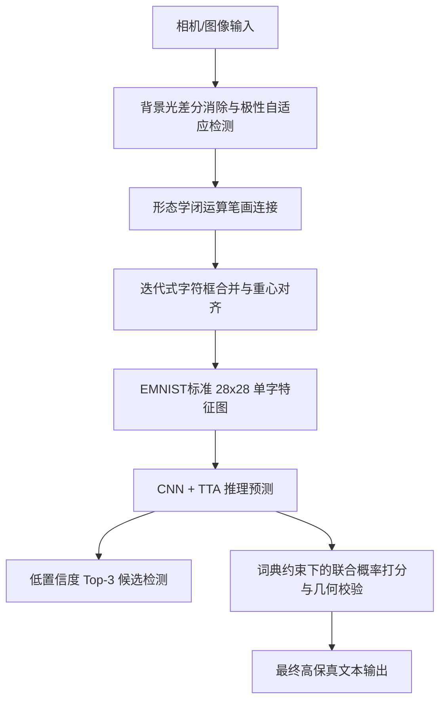

# 基于卷积神经网络的手写体字符识别与智能纠错系统
(Convolutional Neural Network-Based Handwritten Character Recognition and Intelligent Correction System)

[简体中文](README.md) | [English](README_EN.md) | [日本語](README_JA.md)

---

## 🌟 1. 系统概述与技术指标

本系统设计并实现了一个端到端的手写体字符识别（OCR）与智能文本拼写纠错系统。系统基于自定义卷积神经网络（CNN）提取字符形状特征，并在图像获取预处理、字符空间分割、神经网络推理优化、后处理语言模型纠错以及人机交互五个核心环节进行了算法优化与架构实现。

### 系统核心模块与技术路径
* **图像去光照与极性自适应**：利用背景光差分补偿算法去除不均匀环境光照及阴影；引入自适应对比度极性检测机制，自动识别亮底暗字（纸张）与暗底亮字（黑板）字迹。
* **空间分割与合并**：利用形态学闭运算对二值化字迹进行笔画连接，结合迭代式多轮边界框合并算法与重心矩平移对齐，解决手写断笔以及多构件字符（如字母 `i`、`j`）的分割合并问题。
* **卷积网络推理优化**：底层维持 3 层卷积块的 `HandwrittenCNN` 结构，网络层采用 SiLU (Swish) 激活函数与 Kaiming 权重初始化，推理阶段引入测试时增强（TTA）多采样融合及模型预热，优化系统响应速度。
* **后处理拼写纠错**：设计基于最大后验概率（MAP）的词典对数似然打分算法，结合长宽比几何校验与行内相对高度比校验，对易混淆字符对（如 `0/O`、`1/I/l`、大小写等）进行全局多模态纠错。
* **旁路参考系统**：引入百度云手写体 OCR 接口作为对比基准，以便在系统运行中评估本地算法的识别准确率与纠错有效性。
* **异步GUI工作台**：采用 Tkinter 构建响应式单窗口交互界面，集成线程池异步计算，实现摄像头实时画面刷新与后台推理任务的解耦，支持实时和定格模式的一键切换。

---

## 🛠️ 2. 数学建模与核心算法设计

系统数据处理与计算工作流如下图所示：



### 2.1 图像预处理与自适应环境融合

#### 2.1.1 背景光消除差分算法
在真实摄像头拍摄时，环境阴影（如手机、手部投影）会导致二值化产生大量噪点与黑斑。系统构建了背景光消除差分算法。利用大核高斯滤波器估算局部区域的背景照度分布图（Illumination Map），通过矩阵除法运算消除阴影，增强字迹与纸张的对比度。

其数学模型表示为：
令输入的灰度图像为 $I(x, y)$，通过高斯平滑核 $G_{\sigma}$（标准差 $\sigma = 51$）估计背景照度图为 $B(x, y) = (G_{\sigma} \ast I)(x, y)$。去阴影并归一化后的图像强度 $I'(x, y)$ 定义为：

$$
I'(x, y) = \min \left( \frac{I(x, y)}{B(x, y)} \times 255, 255 \right)
$$

整个除法操作利用 OpenCV 的矩阵并行计算执行，可还原出不受光照影响的白底黑字笔画。

#### 2.1.2 自适应对比度极性检测
为使系统自动适应“纸张书写（亮底暗字）”与“黑板板书（暗底亮字）”等不同媒介，系统在对估计的笔画进行分割前，首先提取图像最边缘的像素集合作为背景样本域。
令 $\Omega$ 表示图像区域，$\partial\Omega$ 表示最外层边界区域。系统对二值化图 $T(x, y)$ 在边界区域进行统计，计算背景强度的期望值：

$$
\mu_{\text{bg}} = E_{(x, y) \in \partial\Omega}[T(x, y)]
$$

若 $\mu_{\text{bg}} > 127$（判定背景为亮色），为使字符特征契合神经网络期望的输入分布（即黑底白字），对图像进行反色处理：

$$
T'(x, y) = 255 - T(x, y)
$$

若 $\mu_{\text{bg}} \le 127$（判定背景为暗色，例如黑板），则保持原样输入：

$$
T'(x, y) = T(x, y)
$$

该算法实现了全自动的环境极性自适应转换。

---

### 2.2 字符空间分割与重心对齐

#### 2.2.1 形态学闭运算笔画桥接
手写用力不均或二值化阈值偏高会导致笔画断裂，若直接寻找轮廓会导致单个字符被分割。系统在提取轮廓前，对极性校正后的二值化图像 $T'$ 采用一个 $2 \times 2$ 的矩形结构元 $S$ 执行闭运算（Closing Operation）：

$$
T_c = (T' \oplus S) \ominus S
$$

其中 $\oplus$ 表示膨胀，$\ominus$ 表示腐蚀。该操作能够填补笔画内部的细小洞孔，并桥接小于 $2$ 像素的笔画断裂，提高后续轮廓提取的连贯性。

#### 2.2.2 迭代式边界框合并（Box Merging）
常规字符分割只进行单次顺序扫描合并，极易遗漏非相邻的笔画碎片。系统设计了基于多轮迭代的边界框合并算法，通过自适应启发式准则进行重复迭代，直至框数量收敛。
设两框为 $B_1(x_1, y_1, w_1, h_1)$ 与 $B_2(x_2, y_2, w_2, h_2)$，合并决策准则如下：
1. **嵌套包含检测**：若一框几乎完全内嵌于另一框（容差 $\delta = 3$），则融为一体。
2. **垂直方向重组（解决字母 `i`、`j` 散件问题）**：计算 $B_1$ 与 $B_2$ 在 $X$ 轴上的重叠投影宽度占其最小宽度的比例 $O_x$。若 $O_x > 0.4$，且垂直间距 $\Delta y$ 满足：

   $$
   \Delta y < \max\left(15, 1.8 \cdot \min(h_1, h_2)\right)
   $$

   并且合并后的总高度不超过两框最大高度的 $2.2$ 倍，则判定为同一个字符（如字母的点与杆），执行合并。
3. **水平邻近合并（解决断笔问题）**：当两框垂直重叠比例 $O_y > 0.5$ 时，若水平间距 $\Delta x \le 3$ 像素，或者间距 $\Delta x \le 6$ 且其中一个框的宽度极窄（宽度 $\le 5$ 像素，视为笔画残缺碎片），则触发水平合并。

#### 2.2.3 重心矩平移对齐（EMNIST特征对齐）
为消除字符在边界框内部的位置偏置，系统基于图像物理矩（Image Moments）进行平移对齐。
首先计算字符二值切图 $I(x, y) \in \{0, 1\}$ 的零阶矩 $M_{00}$ 和一阶矩 $M_{10}, M_{01}$：

$$
M_{pq} = \sum_{x} \sum_{y} x^p y^q I(x, y)
$$

得到物理重心坐标 $(x_c, y_c)$：

$$
x_c = \frac{M_{10}}{M_{00}}, \quad y_c = \frac{M_{01}}{M_{00}}
$$

将缩放至 $20 \times 20$ 像素的字符图像放置在 $28 \times 28$ 像素的标准画布上，计算其重心与画布几何中心 $(14.0, 14.0)$ 的位移向量 $(\Delta x, \Delta y)$，并通过仿射矩阵将图像平移对齐：

$$
\begin{bmatrix} \Delta x \\ \Delta y \end{bmatrix} = \begin{bmatrix} 14.0 - x_c \\ 14.0 - y_c \end{bmatrix}
$$

重心对齐消除了手写体带来的平移偏置。

---

### 2.3 神经网络模型与推理优化

#### 2.3.1 HandwrittenCNN 模型架构
模型共包含 3 个卷积块，网络结构参数设计如下表所示：

| 阶段 | 层类型 | 输入尺寸 | 输出尺寸 | 参数/配置 |
| :--- | :--- | :--- | :--- | :--- |
| **卷积块 1** | Conv2d + BatchNorm2d + SiLU | $1 \times 28 \times 28$ | $32 \times 28 \times 28$ | 卷积核 $K=3$, 填充 $P=1$, 步长 $S=1$ |
| | MaxPool2d + Dropout2d | $32 \times 28 \times 28$ | $32 \times 14 \times 14$ | 池化 $2 \times 2$, 丢弃率 $0.15$ |
| **卷积块 2** | Conv2d + BatchNorm2d + SiLU | $32 \times 14 \times 14$ | $64 \times 14 \times 14$ | 卷积核 $K=3$, 填充 $P=1$, 步长 $S=1$ |
| | MaxPool2d + Dropout2d | $64 \times 14 \times 14$ | $64 \times 7 \times 7$ | 池化 $2 \times 2$, 丢弃率 $0.15$ |
| **卷积块 3** | Conv2d + BatchNorm2d + SiLU | $64 \times 7 \times 7$ | $128 \times 7 \times 7$ | 卷积核 $K=3$, 填充 $P=1$, 步长 $S=1$（无池化） |
| **全连接层** | Flatten + Linear + SiLU + Dropout | 6272 | 512 | 丢弃率 $0.5$ |
| **输出层** | Linear | 512 | 62 | 对应 EMNIST 62 类字符 |

#### 2.3.2 Kaiming Normal 权重初始化
为防止深层网络在训练初期出现梯度消失，模型对所有卷积层采用了 Kaiming（He）正态分布初始化：

$$
W \sim \mathcal{N}\left(0, \sigma^2\right), \quad \sigma = \sqrt{\frac{2}{n_{\text{in}}}}
$$

其中 $n_{\text{in}}$ 为输入通道数，全连接层使用均值为 $0$、标准差为 $0.01$ 的正态分布进行初始化，偏置项清零。

#### 2.3.3 测试时增强（TTA, Test-Time Augmentation）推理
在测试与演示阶段，为提升识别算法的泛化性，系统引入了 TTA 多采样融合机制。
对于输入单字图像 $x$，模型通过空间变换生成 11 个扰动变体。令 $T_k(x)$（$k=1,\dots,11$）为经过第 $k$ 种仿射变换（包含 9 种平移与 2 种旋转）后的变体图像。
这些变体在 Batch 维度合并送入模型，对输出的 Softmax 概率求均值：

$$
P(y \mid x) = \frac{1}{11} \sum_{k=1}^{11} P_{\theta}(y \mid T_k(x))
$$

其中 $P_{\theta}(y \mid \cdot)$ 表示参数为 $\theta$ 的神经网络模型输出的分类概率分布。此机制平滑了笔画扰动，提升了分类器的抗噪能力。

---

### 2.4 后处理纠错算法与几何校验

#### 2.4.1 基于最大后验概率（MAP）的词典打分
手写形近字符（如单词 `hello` 易被 CNN 错识别为 `he11O`）是纯视觉分类的瓶颈。当系统检测到序列属于英文单词语境时，在常用英文单词集合 $D_L$（包含 10,000 个常用单词）中进行对数似然打分，寻找最优候选单词 $W^{\star}$：

$$
W^{\star} = \arg\max_{W \in D_L} \sum_{i=1}^{N} \ln \left( P(c_{i,\mathrm{lower}} \mid x_i) + P(c_{i,\mathrm{upper}} \mid x_i) \right)
$$

其中 $N$ 为单词长度，$x_i$ 为分割得到的第 $i$ 个字符图像，$c_{i,\mathrm{lower}}$ 和 $c_{i,\mathrm{upper}}$ 分别是单词 $W$ 中第 $i$ 位字符的小写和大写候选类别。通过对数相加代替概率相乘，避免了数值下溢，提高了纠错算法的稳定性。

#### 2.4.2 长宽比几何校验区分 `0` 与 `O/o`
对于形状高度近似的数字 `0` 和字母 `O/o`，系统在特征维度上引入了长宽比校验。
设分割出的第 $i$ 个字符框宽度为 $w_i$，高度为 $h_i$，其长宽比 $R_i$ 定义为：

$$
R_i = \frac{w_i}{h_i}
$$

当识别结果产生 `0` 与 `O` 的歧义时：
* 若 $R_i < 0.52$，对数字 `0` 的输出概率乘以 $1.5$ 予以奖励，对字母 `O` 与 `o` 的概率乘以 $0.05$ 予以惩罚。
* 若 $R_i \ge 0.52$，则倾向于判定为字母，对其赋予加权。

#### 2.4.3 行内相对高度比大小写纠正
EMNIST 数据集内大小写字形对称的字母（如 `C/c`、`O/o`、`S/s`、`Z/z` 等）极易混淆。系统通过统计多字识别序列，构建了行内空间分布相对高度比 $r_i$：

$$
r_i = \frac{h_i}{\max_{j=1}^N h_j}
$$

对于对称字符，若其空间相对高度比满足 $r_i < 0.78$，则将其纠正映射为其对应的小写字母，反之判定为大写字母。

---

### 2.5 外部参考：百度手写体 OCR 基准引入

#### 2.5.1 引入原因（对比实验对照组）
本地构建的字符识别系统在离线单字分类上具有精度，但为了评估其实时手写文本行分割及单词拼写校正机制在实际表现中的准确率，系统引入了外部手写体 OCR 接口作为参考对照。
* **评估基准**：在用户触发识别时，系统同时输出本地 CNN 结果、拼写纠错后结果以及外部云端 OCR 的识别结果，以便直观对比本地自定义网络与成熟服务的差异，明确本地算法的优化空间。
* **容灾备份**：在手写笔迹严重重叠、本地分割算法失效的极端情况下，作为旁路系统提供文本参考。

#### 2.5.2 引入与实现机制
接口实现文件位于 [src/baidu_ocr.py](file:///C:/Users/Liu/PycharmProjects/PythonProject3/src/baidu_ocr.py)，其集成工作流如下：
1. **凭证获取与缓存**：在系统启动时，客户端读取配置文件中的 API 凭证，向鉴权服务器发起 OAuth 2.0 请求，获取并缓存 `access_token`。
2. **图像编码与发送**：当触发识别任务时，系统从当前相机帧中截取红框选定的 ROI 图像区域，进行压缩编码与 Base64 转换，随后发起 HTTPS POST 请求传送至识别端点。
3. **异步并发请求**：为了避免网络请求带来阻塞，系统在 GUI 中采用后台工作线程发送请求并解析返回数据，以异步更新界面卡片。

---

## 📊 3. 模型训练与性能监控

### 3.1 损失函数与优化器配置
* **带标签平滑的交叉熵损失**：
  设 $y$ 为真实标签，对输入图像 $x$ 的网络预测概率分布为 $p(\cdot \mid x)$。引入标签平滑因子 $\alpha = 0.1$，在类别数 $K = 62$ 的分类任务中，平滑交叉熵损失定义为：

  $$
  L_{\mathrm{smooth}} = -(1 - \alpha) \log p(y \mid x) - \frac{\alpha}{K} \sum_{k=1}^K \log p(k \mid x)
  $$

  该设计降低了网络对样本硬分类的过极性自信（overconfidence），提升了模型对潦草边缘字迹的鲁棒性。
* **参数配置**：使用 Adam 优化器，学习率初始值 $\eta = 10^{-3}$，权重衰减参数（L2 正则化）设置为 $10^{-4}$。
* **负反馈调度与早停**：引入调度机制，若验证集 Loss 连续 3 轮未降低则学习率减半；连续 7 轮不提升则触发早停以结束训练。

### 3.2 数据集结构与数据增强 (get_dataloaders)
数据加载及预处理流水线定义在 [src/utils.py](file:///C:/Users/Liu/PycharmProjects/PythonProject3/src/utils.py) 中：
* **数据来源**：EMNIST Balanced 数据集，包含 62 类手写字符（10 个数字，26 个大写字母，26 个小写字母），总样本数为 814,255 张灰度图。
* **数据切分**：训练集占 $90\%$（约 62.8 万张），验证集占 $10\%$（约 6.9 万张），测试集包含 11.6 万张。
* **学术数据增强手段**：针对摄像头捕捉和签字笔笔画特征，在加载器中集成了数据增强：
  1. **视角矫正**：因原始数据矩阵被转置，需将图像进行 $-90^{\circ}$ 旋转并水平翻转。
  2. **随机仿射变换**：旋转角度限制在 $\pm 15^{\circ}$、平移比率为 $12\%$、缩放范围 $0.8 \sim 1.2$、剪切角为 $12^{\circ}$。
  3. **透视变换**：畸变系数为 $0.2$，概率为 $0.4$，模拟相机偏角。
  4. **弹性形变**：形变系数 $\alpha = 50.0$，概率为 $0.2$，模拟纸张起伏。
  5. **模糊与噪声**：添加高斯模糊（核大小为 $3$）与随机擦除（遮蔽面积 $2\% \sim 10\%$）。

---

## ⚡ 4. UI 交互设计与并发工程学

系统界面使用 Tkinter 构建，提供了一套具有动态反馈的一体化交互面板。

### 4.1 异步多线程执行器（ThreadPoolExecutor）
* **痛点**：若识别推理与网络 API 请求都在 UI 主线程执行，当用户触发识别时，界面画面会瞬间停滞卡死。
* **架构设计**：界面基于线程池将计算任务与相机流渲染完全剥离。
  * **主线程**：维持 $30\text{ ms}$ 的定时回调，驱动 OpenCV 读取摄像头视频，实时完成阴影补偿与二值化处理，在前端保持 $30\text{ FPS}$ 画面刷新。
  * **工作线程**：当用户按下空格键时，从主线程拷贝当前帧图像，交由后台工作线程异步执行推理与接口访问，计算完成后将结果回调刷新回 UI 组件，界面全程无停顿。

### 4.2 动态双状态机（Live / Freeze 模式）
为了便于用户仔细观察并捕捉识别时刻的画面特征，系统建立了双状态机切换逻辑：
* **LIVE 状态**：右上角提示徽章显示绿色 `LIVE`，视频画面与右下角二值化预览图以 $30\text{ FPS}$ 实时跟踪相机视角。
* **FREEZE 状态**：当按下空格键（或点击 Recognize）时，状态机跃迁为 `FREEZE`（目标徽章呈现橙色）。此时画面锁存，系统将在定格的图像上绘制分割出来的字符青色（Cyan）边界框，并在角标处绘制序号。
* **恢复机制**：按下 `Space`、`Enter`、`Esc` 键或点击 `Resume` 按钮，系统解除冻结，切换回 LIVE 状态。

---

## 📂 5. 项目结构与目录规范

```text
PythonProject3/
├── src/
│   ├── __init__.py
│   ├── model.py              # HandwrittenCNN 神经网络结构定义
│   ├── utils.py              # 数据加载器与数据增强变换
│   ├── corrector.py          # 后处理模块：联合概率词典纠错与几何校验
│   ├── baidu_ocr.py          # 旁路对照：百度手写体 OCR 接口封装
│   └── local_ocr.py          # 核心流程：本地预处理、字符闭运算提取与 TTA 推理封装
├── checkpoints/
│   ├── emnist_model.pth      # 训练好的最优模型权重文件
│   ├── emnist_model_backup.pth # 模型备份文件
│   ├── data_augmentation_samples.png # [自动生成] 数据增强样例可视化图像
│   ├── training_curves.png           # [自动生成] 损失与准确率收敛曲线图
│   └── confusion_matrix.png          # [自动生成] 测试集 62 分类混淆矩阵热力图
├── data/                     # 数据集下载目录
├── train.py                  # 神经网络训练与图表资产生成脚本
├── predict.py                # 离线拼写校正模拟与可视化脚本
├── desktop_app.py            # 主程序入口：Tkinter 多线程响应式桌面工作台
├── revert_model.py           # 恢复工具：一键极速还原稳定备份权重
├── README.md                 # 简体中文说明书
├── README_EN.md              # 英文说明书
└── README_JA.md              # 日文说明书
```

---

## 🚀 6. 开发者运行指引

### 6.1 依赖安装与准备
使用 Python 3.10 环境运行以下命令安装依赖：
```bash
pip install -r requirements.txt
```

若需启用百度云手写识别作为旁路对照，可在本地设置环境变量（或保留 `baiduocr/key.txt`）：
```powershell
$env:BAIDU_OCR_API_KEY = "Your_Baidu_API_Key"
$env:BAIDU_OCR_SECRET_KEY = "Your_Baidu_Secret_Key"
```

### 6.2 运行桌面工作台
执行以下命令启动 UI 界面：
```bash
python desktop_app.py
```
* 启动后，若电脑连接有多个外接摄像头，可在聚焦界面时随时按下 **`C` 键**，系统会自动热切换到下一路可用视频源。
* 将手写体纸张置于中央红色框内，按下 **【空格键】** 触发定格识别。
* 右侧结果栏由上至下展示：
  1. 本地 CNN 模型的原始预测结果；
  2. 经过概率词典和几何纠错后的最终修正结果；
  3. 百度手写体云端 OCR 结果（若配置）；
  4. 实时动态的自适应二值化画面（调试时可直观微调笔划清晰度）。
* 再次按下 **空格键/Enter/Esc**，画面恢复实时运转。
* 按下 **`B` 键**，可快速开启或关闭云端旁路。

### 6.3 运行离线比对评测
若需要批量测试词典后处理对相似句子的纠正表现，可启动评测脚本：
```bash
python predict.py
```
它会输出多组模拟混淆单词（例如把手写错字序列 `he11o` 纠正为 `hello`）的比对精度，并加载 EMNIST 测试集样本弹出可视化窗口。
