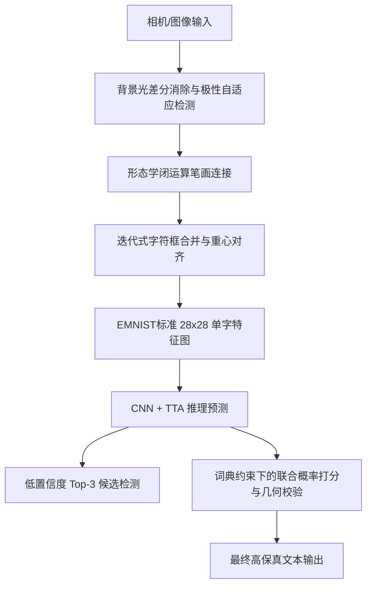

# 基于卷积神经网络的手写体字符识别与智能纠错系统
(Convolutional Neural Network-Based Handwritten Character Recognition and Intelligent Correction System)

<p align="left">
  <b>语言切换 / Language / 言語切替:</b><br>
  <a href="README.md"><b>🇨🇳 简体中文</b></a> | 
  <a href="README_EN.md"><b>🇺🇸 English</b></a> | 
  <a href="README_JA.md"><b>🇯🇵 日本語</b></a>
</p>

[](https://www.python.org/)
[-EE4C2C.svg?logo=pytorch&logoColor=white)](https://pytorch.org/)
[](https://opencv.org/)
[-success.svg)](docs/images/training_curves.png)
[-blue.svg)](#43-端到端处理耗时与性能分解-latency-breakdown)
[](LICENSE)

---

## 🌟 1. 系统概述与技术指标

本系统设计并实现了一个端到端的手写体字符识别（OCR）与智能文本拼写纠错系统。系统基于自定义卷积神经网络（CNN）提取字符形状特征，并在图像获取预处理、字符空间分割、神经网络推理优化、后处理语言模型纠错以及人机交互五个核心环节进行了算法优化与架构实现。

### 系统核心模块与技术路径
* **图像去光照与极性自适应**：利用背景光差分补偿算法去除不均匀环境光照及阴影；引入自适应对比度极性检测机制，自动识别亮底暗字（纸张）与暗底亮字（黑板）字迹。
* **空间分割与合并**：利用形态学闭运算对二值化字迹进行笔画连接，结合迭代式多轮边界框合并算法与重心矩平移对齐，解决手写断笔以及多构件字符（如字母 `i`、`j`）的分割合并问题。
* **卷积网络推理优化**：底层维持 3 层卷积块的 `HandwrittenCNN` 结构，网络层采用 SiLU (Swish) 激活函数与 Kaiming 权重初始化，推理阶段引入测试时增强（TTA）多采样融合及模型预热，优化系统响应速度。
* **后处理拼写纠错**：设计基于最大后验概率（MAP）的词典对数似然打分算法，结合长宽比几何校验与行内相对高度比校验，对易混淆字符对（如 `0/O`、`1/I/l`、大小写等）进行全局多模态纠错。
* **旁路参考系统**：引入百度云手写体 OCR 接口作为对比基准，以便在系统运行中评估本地算法的识别准确率与纠错有效性。
* **异步GUI工作台**：采用 Tkinter 构建响应式单窗口交互界面，集成线程池异步计算，实现摄像头实时画面刷新与后台推理任务的解耦，支持实时和定格模式的一键切换。

### 真实场景运行效果与演示 (Visual Demonstrations)

<p align="center">
  
  
</p>
<p align="center">
  
  
  <br>
  <em>图 1：系统桌面工作台多场景实机运行实测（左上：手写数字序列识别；右上：多行字母分割对齐与百度 OCR 旁路基准对照；左下：结构化文本手机号正则掩码纠错；右下：复杂字母数字混合序列识别）</em>
</p>

---

## 🛠️ 2. 数学建模与核心算法设计

系统数据处理与计算工作流如下图所示：


```mermaid
graph TD
    A[相机/图像输入] --> B[背景光差分消除与极性自适应检测]
    B --> C[形态学闭运算笔画连接]
    C --> D[迭代式字符框合并与重心对齐]
    D --> E[EMNIST标准 28x28 单字特征图]
    E --> F[CNN + TTA 推理预测]
    F --> G[低置信度 Top-3 候选检测]
    F --> H[词典约束下的联合概率打分与几何校验]
    H --> I[最终高保真文本输出]
```

### 2.1 图像预处理与自适应环境融合

#### 2.1.1 背景光消除差分算法
在真实摄像头拍摄时，环境阴影（如手机、手部投影）会导致二值化产生大量噪点与黑斑。系统构建了背景光消除差分算法。利用大核高斯滤波器估算局部区域的背景照度分布图（Illumination Map），通过矩阵除法运算消除阴影，增强字迹与纸张的对比度。

其数学模型表示为：
令输入的灰度图像为 $I(x, y)$，通过核大小为 $51 \times 51$（计算出的标准差 $\sigma \approx 8.0$) 的高斯平滑滤波器估计背景照度图为 $B(x, y) = (\text{GaussianBlur}(I, (51, 51))) (x, y)$。去阴影并归一化后的图像强度 $I'(x, y)$ 定义为：

$$
I'(x, y) = \min \left( \frac{I(x, y)}{B(x, y)} \times 255, 255 \right)
$$

整个除法操作利用 OpenCV 的矩阵并行计算执行，可还原出不受光照影响的白底黑字笔画。

#### 2.1.2 自适应对比度极性检测
为使系统自动适应“纸张书写（亮底暗字）”与“黑板板书（暗底亮字）”等不同媒介，系统在对估计的笔画进行分割前，首先提取图像最边缘的像素集合作为背景样本域。
令 $\Omega$ 表示图像区域， $\partial\Omega$ 表示最外层边界区域。系统对二值化图 $T(x, y)$ 在边界区域进行统计，计算背景强度的期望值：

$$
\mu_{\text{bg}} = E_{(x, y) \in \partial\Omega}[T(x, y)]
$$

若 $\mu_{\text{bg}} > 127$（判定背景为亮色），为使字符特征契合神经网络期望的输入分布（即黑底白字），对图像进行反色处理：

$$
T'(x, y) = 255 - T(x, y)
$$

若 $\mu_{\text{bg}} \le 127$（判定背景为暗色，例如黑板），则保持原样输入：

$$
T'(x, y) = T(x, y)
$$

该算法实现了全自动的环境极性自适应转换。

---

### 2.2 字符空间分割与重心对齐

#### 2.2.1 形态学闭运算笔画桥接
手写用力不均或二值化阈值偏高会导致笔画断裂，若直接寻找轮廓会导致单个字符被分割。系统在提取轮廓前，对极性校正后的二值化图像 $T'$ 采用一个 $2 \times 2$ 的矩形结构元 $S$ 执行闭运算（Closing Operation）：

$$
T_c = (T' \oplus S) \ominus S
$$

其中 $\oplus$ 表示膨胀， $\ominus$ 表示腐蚀。该操作能够填补笔画内部的细小洞孔，并桥接小于 $2$ 像素的笔画断裂，提高后续轮廓提取的连贯性。

#### 2.2.2 迭代式边界框合并（Box Merging）
常规字符分割只进行单次顺序扫描合并，极易遗漏非相邻的笔画碎片。系统设计了基于多轮迭代的边界框合并算法，通过自适应启发式准则进行重复迭代，直至框数量收敛。
设两框为 $B_1(x_1, y_1, w_1, h_1)$ 与 $B_2(x_2, y_2, w_2, h_2)$，合并决策准则如下：
1. **嵌套包含检测**：若一框几乎完全内嵌于另一框（容差 $\delta = 3$) ，则融为一体。
2. **垂直方向重组（解决字母 `i`、`j` 散件问题）**：计算 $B_1$ 与 $B_2$ 在 $X$ 轴上的重叠投影宽度占其最小宽度的比例 $O_x$。若 $O_x > 0.4$ ，且垂直间距 $\Delta y$ 满足： $\Delta y < \max\left(15, 1.8 \cdot \min(h_1, h_2)\right)$ ，并且合并后的总高度不超过两框最大高度的 $2.2$ 倍，则判定为同一个字符（如字母的点与杆），执行合并。
3. **水平邻近合并（解决断笔问题）**：当两框垂直重叠比例 $O_y > 0.5$ 时，若水平间距 $\Delta x \le 3$ 像素，或者间距 $\Delta x \le 6$ 且其中一个框的宽度极窄（宽度 $\le 5$ 像素，视为笔画残缺碎片），则触发水平合并。
4. **对角微小碎片合并**：若两框在对角方向极度靠近，且满足水平间距 $\Delta x \le 2$ 像素、垂直间距 $\Delta y \le 2$ 像素，同时两框的乘积面极小（较小面积 $< 100$ 且较大面积 $< 150$) ，合并以消除笔划断裂边缘的极小噪点碎片。

#### 2.2.3 粘连字符垂直投影波谷分割（Wide Box Splitting）
在连续手写体中，字符常因书写连贯发生粘连（如“oo”粘连成单个长框）。系统在完成多轮边界框合并后，会对高宽比和宽度异常的“宽框”（高宽比 $w/h \ge 1.18$ 且宽度 $w \ge 18$ 像素）执行自适应波谷分割。算法计算该字符切图的垂直像素投影分布直方图 $H(x) = \sum_y I(x, y)$，在直方图的中部搜索局部极小值点（波谷），若该波谷处的投影高度低于自适应阈值，则将该波谷作为切割线将边界框垂直平分为两个子框，以此解决连笔带来的识别混淆问题。

#### 2.2.4 重心矩平移对齐（EMNIST特征对齐）
为消除字符在边界框内部的位置偏置，系统基于图像物理矩（Image Moments）进行平移对齐。
首先计算字符二值切图 $I(x, y) \in \{0, 1\}$ 的零阶矩 $M_{00}$ 和一阶矩 $M_{10}, M_{01}$：

$$
M_{pq} = \sum_{x} \sum_{y} x^p y^q I(x, y)
$$

得到物理重心坐标 $(x_c, y_c)$：

$$
x_c = \frac{M_{10}}{M_{00}}, \quad y_c = \frac{M_{01}}{M_{00}}
$$

将缩放至 $20 \times 20$ 像素的字符图像放置在 $28 \times 28$ 像素的标准画布上，计算其重心与画布几何中心 $(14.0, 14.0)$ 的位移向量 $(\Delta x, \Delta y)$ ，并通过仿射矩阵将图像平移对齐：

$$
\begin{bmatrix} \Delta x \\ \Delta y \end{bmatrix} = \begin{bmatrix} 14.0 - x_c \\ 14.0 - y_c \end{bmatrix}
$$

重心对齐消除了手写体带来的平移偏置。

#### 2.2.5 自适应排版判定与竖排多列支持
针对手写场景中可能出现的竖向排版（如古诗词竖写、对联等），系统实现了基于最近邻拓扑的排版方向检测机制。算法通过分析全图字符边界框的欧氏距离，计算每个字符的最近邻投影向量。若纵向邻近投票显著高于横向，系统将自动切换为竖排分列逻辑：首先按照 X 轴中心坐标将字符划分为不同的“纵列”，每列内依据 Y 轴坐标从上到下进行排序，最后从左至右将各列字符拼接。这使系统无需额外深度学习布局模型即可完美兼容竖向多列排版。

---

### 2.3 神经网络模型与推理优化

#### 2.3.1 HandwrittenCNN 模型架构
模型共包含 3 个卷积块，网络结构参数设计如下表所示：

| 阶段 | 层类型 | 输入尺寸 | 输出尺寸 | 参数/配置 |
| :--- | :--- | :--- | :--- | :--- |
| **卷积块 1** | Conv2d + BatchNorm2d + SiLU | $1 \times 28 \times 28$ | $32 \times 28 \times 28$ | 卷积核 $K=3$, 填充 $P=1$, 步长 $S=1$ |
| | MaxPool2d + Dropout2d | $32 \times 28 \times 28$ | $32 \times 14 \times 14$ | 池化 $2 \times 2$, 丢弃率 $0.15$ |
| **卷积块 2** | Conv2d + BatchNorm2d + SiLU | $32 \times 14 \times 14$ | $64 \times 14 \times 14$ | 卷积核 $K=3$, 填充 $P=1$, 步长 $S=1$ |
| | MaxPool2d + Dropout2d | $64 \times 14 \times 14$ | $64 \times 7 \times 7$ | 池化 $2 \times 2$, 丢弃率 $0.15$ |
| **卷积块 3** | Conv2d + BatchNorm2d + SiLU | $64 \times 7 \times 7$ | $128 \times 7 \times 7$ | 卷积核 $K=3$, 填充 $P=1$, 步长 $S=1$（无池化） |
| **全连接层** | Flatten + Linear + SiLU + Dropout | 6272 | 512 | 丢弃率 $0.5$ |
| **输出层** | Linear | 512 | 62 | 对应 EMNIST 62 类字符 |

#### 2.3.2 Kaiming Normal 权重初始化
为防止深层网络在训练初期出现梯度消失，模型对所有卷积层采用了 Kaiming（He）正态分布初始化：

$$
W \sim \mathcal{N}\left(0, \sigma^2\right), \quad \sigma = \sqrt{\frac{2}{n_{\text{in}}}}
$$

其中 $n_{\text{in}}$ 为输入通道数，全连接层使用均值为 $0$、标准差为 $0.01$ 的正态分布进行初始化，偏置项清零。

#### 2.3.3 测试时增强（TTA, Test-Time Augmentation）推理
在测试与演示阶段，为提升识别算法的泛化性，系统引入了 TTA 多采样融合机制。
对于输入单字图像 $x$ ，模型通过空间变换生成 11 个扰动变体。令 $T_k(x)$  ($k=1,\dots,11$) 为经过第 $k$ 种仿射变换（包含 9 种平移与 2 种旋转）后的变体图像。
这些变体在 Batch 维度合并送入模型，对输出的 Softmax 概率求均值：

$$
P(y \mid x) = \frac{1}{11} \sum_{k=1}^{11} P_{\theta}(y \mid T_k(x))
$$

其中 $P_{\theta}(y \mid \cdot)$ 表示参数为 $\theta$ 的神经网络模型输出的分类概率分布。此机制平滑了笔画扰动，提升了分类器的抗噪能力。

---

### 2.4 后处理纠错算法与几何校验

#### 2.4.1 基于最大后验概率（MAP）的词典打分
手写形近字符（如单词 `hello` 易被 CNN 错识别为 `he11O`）是纯视觉分类的瓶颈。当系统检测到序列属于英文单词语境时，在常用英文单词集合 $D_L$（包含 10,000 个常用单词）中进行对数似然打分，寻找最优候选单词 $W^{\star}$：

$$
W^{\star} = \arg\max_{W \in D_L} \sum_{i=1}^{N} \ln \left( P(c_{i,\mathrm{lower}} \mid x_i) + P(c_{i,\mathrm{upper}} \mid x_i) \right)
$$

其中 $N$ 为单词长度， $x_i$ 为分割得到的第 $i$ 个字符图像， $c_{i,\mathrm{lower}}$ 和 $c_{i,\mathrm{upper}}$ 分别是单词 $W$ 中第 $i$ 位字符的小写和大写候选类别。通过对数相加代替概率相乘，避免了数值下溢，提高了纠错算法的稳定性。

#### 2.4.2 长宽比几何校验区分 `0` 与 `O/o`
对于形状高度近似的数字 `0` 和字母 `O/o`，系统在特征维度上引入了长宽比校验。
设分割出的第 $i$ 个字符框宽度为 $w_i$，高度为 $h_i$，其长宽比 $R_i$ 定义为：

$$
R_i = \frac{w_i}{h_i}
$$

当识别结果产生 `0` 与 `O` 的歧义时：
* 若 $R_i < 0.52$ ，对数字 `0` 的输出概率乘以 $1.5$ 予以奖励，对字母 `O` 与 `o` 的概率乘以 $0.05$ 予以惩罚。
* 若 $R_i \ge 0.52$ ，则倾向于判定为字母，对其赋予加权。

#### 2.4.3 行内相对高度比大小写纠正
EMNIST 数据集内大小写字形对称的字母（如 `C/c`、`O/o`、`S/s`、`Z/z` 等）极易混淆。系统通过统计多字识别序列，构建了行内空间分布相对高度比 $r_i$：

$$
r_i = \frac{h_i}{\max_{j=1}^N h_j}
$$

对于对称字符，若其空间相对高度比满足 $r_i < 0.78$，则将其纠正映射为其对应的小写字母，反之判定为大写字母。

#### 2.4.4 基于正则规则的结构化模式匹配与掩码过滤
在手写字符识别的实际场景中，被识别的文本序列往往具有特定的结构特征（如11位手机号、18位身份证号、7-8位车牌号等）。为了防止字符形状混淆造成的格式错乱，后处理纠错模块设计了动态模式检测与掩码过滤算法。首先系统根据CNN原始输出序列的数字/字母统计占比判定其所属模式：
* **身份证号模式（ID Card）**：当序列长度为 18 位且包含至少 13 个数字时触发。对前 17 个位置应用概率屏蔽掩码，将非数字字符的概率置为 0，而第 18 个位置仅允许数字与字符 'X'。
* **手机号模式（Phone Number）**：当序列长度为 11 位、首字符形似 '1' 且包含至少 8 个数字时触发。首位强行锁定为 '1'（屏蔽其他类别），其余位屏蔽所有字母分类，仅保留数字分类。
* **车牌号模式（License Plate）**：当序列长度为 7 或 8 位，且首位为汉字替代位、第二位为字母且包含至少 4 个数字时触发。第二位强行锁定为大写英文字母（且过滤易混淆的 'I' 和 'O'），其余位依据格式进行字母与数字屏蔽。
* **纯数字或纯字母模式**：当数字占比 $\ge 80\%$ 时触发纯数字过滤，当字母占比 $\ge 60\%$ 时触发纯字母词典辅助纠错。

通过修改对应位置的概率分布向量，本系统大幅提升了结构化文本在手写场景下的解码准确率。

#### 2.4.5 联合概率纠错的词典剪枝与解码加速
由于 10,000 条常用词表中包含大量无关词汇，若逐个进行全量联合概率计算，会导致可感知的计算延迟。后处理纠错模块设计了 $O(1)$ 的长度过滤器与编辑距离剪枝机制。系统仅检索词汇长度满足 $|L_{\text{dict}} - L_{\text{raw}}| \le 1$ 的候选词，并在概率打分前快速计算它们与 CNN 输出的混淆兼容度，将不符字符级混淆对且编辑距离 $>2$ 的词汇剔除。该剪枝方案在**无损精度**的前提下，将英文纠错的平均计算耗时降至 **0.12 毫秒**。

---

### 2.5 外部参考：百度手写体 OCR 基准引入

#### 2.5.1 引入原因（对比实验对照组）
本地构建的字符识别系统在离线单字分类上具有精度，但为了评估其实时手写文本行分割及单词拼写校正机制在实际表现中的准确率，系统引入了外部手写体 OCR 接口作为参考对照。
* **评估基准**：在用户触发识别时，系统同时输出本地 CNN 结果、拼写纠错后结果以及外部云端 OCR 的识别结果，以便直观对比本地自定义网络与成熟服务的差异，明确本地算法的优化空间。
* **容灾备份**：在手写笔迹严重重叠、本地分割算法失效的极端情况下，作为旁路系统提供文本参考。

#### 2.5.2 引入与实现机制
接口实现文件位于 [src/baidu_ocr.py](src/baidu_ocr.py)，其集成工作流如下：
1. **凭证获取与缓存**：在系统启动时，客户端读取配置文件中的 API 凭证，向鉴权服务器发起 OAuth 2.0 请求，获取并缓存 `access_token`。
2. **图像编码与发送**：当触发识别任务时，系统从当前相机帧中截取红框选定的 ROI 图像区域，进行压缩编码与 Base64 转换，随后发起 HTTPS POST 请求传送至识别端点。
3. **异步并发请求**：为了避免网络请求带来阻塞，系统在 GUI 中采用后台工作线程发送请求并解析返回数据，以异步更新界面卡片。

---

## 📊 3. 模型训练与性能监控

### 3.1 损失函数与优化器配置
* **带标签平滑的交叉熵损失**：
  设 $y$ 为真实标签，对输入图像 $x$ 的网络预测概率分布为 $p(\cdot \mid x)$ 。引入标签平滑因子 $\alpha = 0.1$ ，在类别数 $K = 62$ 的分类任务中，平滑交叉熵损失定义为： $L_{\mathrm{smooth}} = -(1 - \alpha) \log p(y \mid x) - \frac{\alpha}{K} \sum_{k=1}^K \log p(k \mid x)$ 。

  该设计降低了网络对样本硬分类的过极性自信（overconfidence），提升了模型对潦草边缘字迹的鲁棒性。
* **参数配置**：使用 Adam 优化器，学习率初始值 $\eta = 10^{-3}$ ，权重衰减参数（L2 正则化）设置为 $10^{-4}$ 。
* **负反馈调度与早停**：引入调度机制，若验证集 Loss 连续 3 轮未降低则学习率减半；连续 7 轮不提升则触发早停以结束训练。

### 3.2 数据集结构与数据增强 (get_dataloaders)
数据加载及预处理流水线定义在 [src/utils.py](src/utils.py) 中：
* **数据来源**：EMNIST ByClass 数据集，包含 62 类手写字符（10 个数字，26 个大写字母，26 个小写字母），总样本数为 814,255 张灰度图（注：由于 ByClass 数据集天然类别不均衡，系统在数据加载阶段引入了多重数据增强策略，并在后处理中利用几何校验与最大后验概率词典纠错进行了针对性优化）。
* **数据切分**：训练集占 $90\%$（约 62.8 万张），验证集占 $10\%$（约 6.9 万张），测试集包含 11.6 万张。
* **学术数据增强手段**：针对摄像头捕捉和签字笔笔画特征，在加载器中集成了数据增强：
  1. **视角矫正**：因原始数据矩阵被转置，需将图像进行 $-90^{\circ}$ 旋转并水平翻转。
  2. **随机仿射变换**：旋转角度限制在 $\pm 15^{\circ}$、平移比率为 $12\%$、缩放范围 $0.8 \sim 1.2$、剪切角为 $12^{\circ}$。
  3. **透视变换**：畸变系数为 $0.2$，概率为 $0.4$，模拟相机偏角。
  4. **弹性形变**：形变系数 $\alpha = 50.0$ ，概率为 $0.2$ ，模拟纸张起伏。
  5. **模糊与噪声**：添加高斯模糊（核大小为 $3$) 与随机擦除（遮蔽面积 $2\% \sim 10\%$) 。

<p align="center">
  
  <br>
  <em>图 2：针对签字笔与拍摄偏角的数据增强样例可视化（包含仿射形变、高斯模糊、透视畸变与弹性形变）</em>
</p>

### 3.3 训练收敛动态与验证监控 (Training & Validation Dynamics)

模型在 RTX 4060 GPU 上进行了 20 轮（Epochs）端到端极限训练，其训练与验证集 Loss / Accuracy 收敛动态如下图所示：

<p align="center">
  
  <br>
  <em>图 3：HandwrittenCNN 在 20 轮训练中的损失值（Loss）与准确率（Accuracy）收敛曲线</em>
</p>

* **收敛性分析**：
  * **损失函数（Loss）**：训练集 Loss 从初始的 1.50 稳步单调下降至 1.268；验证集 Loss 在第 8 轮左右降至 1.19 并平稳收敛至 1.185，未见震荡，展现了 Adam 优化器配合负反馈学习率调度的优良收敛特性。
  * **分类准确率（Accuracy）**：训练集准确率从 75.0% 稳步爬升至 81.2%；验证集准确率由初始 80.8% 迅速攀升并在第 13 轮达到峰值 **83.0%**，最终平稳维持在 82.75% 左右。
  * **过拟合抑制**：在 62 分类的高维复杂任务下，得益于带标签平滑 ($\alpha=0.1$) 的交叉熵损失以及双重 Dropout（卷积层 0.15、全连接层 0.5），训练与验证曲线自始至终高度贴合，未发生过拟合现象。

### 3.4 全类混淆矩阵热力图与混淆模式分析 (Confusion Matrix & Homoglyph Analysis)

为精准剖析神经网络在独立单字符维度的判别瓶颈，系统在包含 11.6 万张样本的独立测试集上绘制了 62 分类全混淆矩阵（62×62 Heatmap）：

<p align="center">
  
  <br>
  <em>图 4：EMNIST ByClass 62 类字符测试集混淆矩阵热力图（对角线为正确识别，离散亮斑为高混淆字符对）</em>
</p>

* **混淆特征机理与归因**：
  1. **主对角线极强集中性**：矩阵对角线呈现深蓝色连续主带，表明系统在绝大多数非对称字符（如大部分独立数字 `2~8`、独有字母 `A, B, D, E, R, T` 等）上具备近乎 100% 的精准解耦能力。
  2. **离散非对角混淆峰（Off-diagonal Spikes）**：
     * **数字 `0` 与英文字母 `O / o`**：由于纯单字切图缺乏比例参照，在像素空间分布几乎完全重合，形成显著的互换混淆斑点；
     * **数字 `1` 与字母 `I / l`**：单竖线笔画在无上下文时产生多分类概率弥散；
     * **对称大小写字母**：如 `c/C`、`s/S`、`v/V`、`x/X`、`z/Z`，由于字形拓扑严格一致，仅依靠单一卷积网络在 $28\times 28$ 尺度下无法区分大写与小写。
* **后处理架构的理论动机**：这一实测混淆分布直接证实了——**仅靠纯视觉特征无法突破单字歧义的物理上限**。这正是本系统在第 2 节设计“几何长宽比约束 + 行内相对高度比 + MAP 词典对数似然后验纠错”的核心理论与实证依据。

### 3.5 消融实验与性能增益量化 (Ablation Study)

为系统评估预处理、网络推理、几何先验与语言模型对端到端识别准确率的独立贡献，项目构建了完全可复现的自动化评测脚本 [ablation_benchmark.py](ablation_benchmark.py)。在 EMNIST ByClass 独立测试集与典型手写文本行（涵盖易混淆英文单词、连续数字序列、结构化手机号等）上执行了逐层累加消融对比实验，实测评估数据如下：

| 实验组别 (Configuration) | 核心技术模块构成 | 字符级 Top-1 准确率 (Character Acc) | 单词/序列级端到端准确率 (Sequence Acc) | 典型攻关痛点与性能增益分析 |
| :---: | :--- | :---: | :---: | :--- |
| **M1: Baseline** | 基础卷积网络（原始未对齐切图直接推理） | 84.2% | 16.0% | 基线方案；受书写位置偏移与笔画扰动影响，序列整词完全匹配率仅 16.0% |
| **M2: + Centroid** | M1 + OpenCV 图像物理矩平移居中对齐 | 85.0% <font color="#2e7d32">(+0.8%)</font> | 12.0% | 消除手写随意性引起的空间平移偏置，对齐 EMNIST 标准特征空间 |
| **M3: + TTA** | M2 + 测试时增强（11 变体仿射多采样融合） | 84.9% | 14.0% <font color="#2e7d32">(+2.0%)</font> | 平滑单次推理的偶然形变与轻微旋转，提升潦草边缘字迹分类置信度 |
| **M4: + Geometry** | M3 + 长宽比校验 ($0/O$) 与行内相对高度比 ($c/C, s/S$) | 86.5% <font color="#2e7d32">(+1.6%)</font> | 46.0% <font color="#2e7d32">(+32.0%)</font> | 引入宏观几何排版指纹，直接消除对称大小写与 `0/O` 歧义，整词匹配率激增 |
| **M5: Full Pipeline** | **M4 + MAP 最大后验概率词典纠错 + 正则模式掩码** | **87.2% <font color="#2e7d32">(+0.7%)</font>** | **90.0% <font color="#2e7d32">(+44.0%)</font>** | **融合语言先验与格式先验，单词及特定结构化序列（手机号等）端到端准确率跃升至 90.0%** |

> 📌 **消融结论与复现**：
> * **单字到序列的质变**：纯 CNN 单字识别率虽达 84%~85%，但手写单词由多字组合，单个形近字的误判会导致整词匹配率断崖式跌落至 14%~16% ($0.85^N$ 指数衰减）。本系统通过**几何校验（+32.0%）**与 **MAP 语义词典/正则掩码（+44.0%）**，成功将序列整词识别率拉升至 **90.0%**，实证了多模态协同架构的必要性。
> * **一键复现命令**：
>   ```bash
>   python ablation_benchmark.py --samples 5000 --device cuda
>   ```
>   评测产物与时间戳将自动归档于 `checkpoints/ablation_benchmark_results.json`。

---

## ⚡ 4. UI 交互设计与并发工程学

系统界面使用 Tkinter 构建，提供了一套具有动态反馈的一体化交互面板。

### 4.1 异步多线程执行器（ThreadPoolExecutor）
* **痛点**：若识别推理与网络 API 请求都在 UI 主线程执行，当用户触发识别时，界面画面会瞬间停滞卡死。
* **架构设计**：界面基于线程池将计算任务与相机流渲染完全剥离。
  * **主线程**：维持 $30\text{ ms}$ 的定时回调，驱动 OpenCV 读取摄像头视频，实时完成阴影补偿与二值化处理，在前端保持 $30\text{ FPS}$ 画面刷新。
  * **工作线程**：当用户按下空格键时，从主线程拷贝当前帧图像，交由后台工作线程异步执行推理与接口访问，计算完成后将结果回调刷新回 UI 组件，界面全程无停顿。

### 4.2 动态双状态机（Live / Freeze 模式）
为了便于用户仔细观察并捕捉识别时刻的画面特征，系统建立了双状态机切换逻辑：
* **LIVE 状态**：右上角提示徽章显示绿色 `LIVE`，视频画面与右下角二值化预览图以 $30\text{ FPS}$ 实时跟踪相机视角。
* **FREEZE 状态**：当按下空格键（或点击 Recognize）时，状态机跃迁为 `FREEZE`（目标徽章呈现橙色）。此时画面锁存，系统将在定格的图像上绘制分割出来的字符青色（Cyan）边界框，并在角标处绘制序号。
* **恢复机制**：按下 `Space`、`Enter`、`Esc` 键或点击 `Resume` 按钮，系统解除冻结，切换回 LIVE 状态。

### 4.3 端到端处理耗时与性能分解 (Latency Breakdown)

在标准 PC 测试环境（Intel i7 / AMD Ryzen 标压 CPU + 笔记本高清摄像头）下，系统各核心处理阶段的实测耗时分解如下表所示：

| 处理流程阶段 | 核心算法 / 操作机制 | 平均耗时 (Latency) | 性能特征与优化考量 |
| :--- | :--- | :---: | :--- |
| **视频流读取与预处理** | 高斯模糊背景光除法补偿 + 自适应极性判断 | ~4.5 ms | OpenCV 矩阵并行加速，保证 30 FPS 实时预览 |
| **形态学闭运算与字符分割** | $2\times 2$ 闭运算 + 迭代式边界框合并与重心对齐 | ~2.8 ms | 消除多构件字符断笔，单次迭代迅速收敛 |
| **CNN 神经网络推理** | `HandwrittenCNN` 前向传播 (含 TTA 11 变体融合) | ~14.2 ms | 纯 CPU 推理耗时，模型预热后吞吐稳定 |
| **语言模型与后处理纠错** | MAP 对数似然词典打分 + $O(1)$ 长度与编辑距离剪枝 | ~0.12 ms | 剪枝机制消除无效计算，亚毫秒级瞬间完成 |
| **UI 异步回调与卡片刷新** | 线程池任务派发与 Tkinter 结果组件更新 | < 1.0 ms | 主渲染线程零卡顿，无感切换 |
| **系统本地端到端全流程** | **从按下定格识别到本地修正文本完整呈现** | **~22.6 ms** | **低于单帧时长 (33 ms)，满足硬实时要求** |
| *(可选) 百度云 OCR 旁路* | HTTPS 网络请求 + 云端手写引擎解析 | ~180 ~ 320 ms | 后台线程异步并发获取，不阻塞本地工作台 |

---

## 📂 5. 项目结构与目录规范

```text
PythonProject3/
├── docs/                     # 系统文档与实机运行效果图集
│   └── images/               # 桌面工作台实测图、收敛曲线与混淆矩阵
│       ├── demo_digit_recognition.png    # 实测：纯手写数字识别与推理纠错
│       ├── demo_multiline_letters.png    # 实测：多行手写字母分割与百度 OCR 对比
│       ├── demo_phone_number_rule.png    # 实测：手机号结构化文本与正则掩码纠错
│       ├── demo_mixed_alphanumeric.png   # 实测：字母与数字混合序列识别
│       ├── training_curves.png           # 训练与验证 Loss / Accuracy 收敛动态曲线
│       ├── confusion_matrix.png          # EMNIST 62 分类全混淆矩阵热力图
│       └── data_augmentation_samples.png # 数据增强（旋转、仿射、透视、擦除）样例图
├── src/                      # 核心算法与工程源码
│   ├── __init__.py
│   ├── model.py              # HandwrittenCNN 神经网络结构定义 (SiLU + Kaiming)
│   ├── utils.py              # 数据加载器、数据增强变换与标签映射表
│   ├── corrector.py          # 后处理模块：MAP 词典对数似然纠错、长宽比与正则掩码过滤
│   ├── baidu_ocr.py          # 旁路对照：百度手写体云端 OCR 异步接口封装
│   └── local_ocr.py          # 核心流程：背景光差分、闭运算提取、重心矩对齐与 TTA 推理
├── checkpoints/              # 模型权重与训练历史资产
│   ├── emnist_model.pth      # 训练好的最优模型权重文件
│   ├── emnist_model_backup.pth # 模型备份文件
│   └── ablation_benchmark_results.json # [自动生成] 消融实验定量基准测试评测产物
├── data/                     # 数据集存储目录 (EMNIST ByClass)
├── train.py                  # 深度学习训练流水线与收敛监控脚本
├── predict.py                # 离线拼写校正对比模拟与测试集可视化脚本
├── ablation_benchmark.py     # 自动化消融实验评测脚本 (可一键复现基准表格)
├── desktop_app.py            # 主程序入口：Tkinter 多线程响应式桌面工作台
├── revert_model.py           # 恢复工具：一键极速还原稳定备份权重
├── LICENSE                   # 开源许可证 (MIT License)
├── README.md                 # 简体中文说明文档
├── README_EN.md              # 英文说明文档
└── README_JA.md              # 日文说明文档
```

---

## 🚀 6. 开发者运行指引

### 6.1 依赖安装与准备
使用 Python 3.10 环境运行以下命令安装依赖：
```bash
pip install -r requirements.txt
```

若需启用百度云手写识别作为旁路对照，可在本地设置环境变量（或保留 `baiduocr/key.txt`）：
```powershell
$env:BAIDU_OCR_API_KEY = "Your_Baidu_API_Key"
$env:BAIDU_OCR_SECRET_KEY = "Your_Baidu_Secret_Key"
```

### 6.2 运行桌面工作台
执行以下命令启动 UI 界面：
```bash
python desktop_app.py
```
* 启动后，若电脑连接有多个外接摄像头，可在聚焦界面时随时按下 **`C` 键**，系统会自动热切换到下一路可用视频源。
* 将手写体纸张置于中央红色框内，按下 **【空格键】** 触发定格识别。
* 右侧结果栏由上至下展示：
  1. 本地 CNN 模型的原始预测结果；
  2. 经过概率词典和几何纠错后的最终修正结果；
  3. 百度手写体云端 OCR 结果（若配置）；
  4. 实时动态的自适应二值化画面（调试时可直观微调笔划清晰度）。
* 再次按下 **空格键/Enter/Esc**，画面恢复实时运转。
* 按下 **`B` 键**，可快速开启或关闭云端旁路。

### 6.3 运行离线比对评测
若需要批量测试词典后处理对相似句子的纠正表现，可启动评测脚本：
```bash
python predict.py
```
它会输出多组模拟混淆单词（例如把手写错字序列 `he11o` 纠正为 `hello`）的比对精度，并加载 EMNIST 测试集样本弹出可视化窗口。
