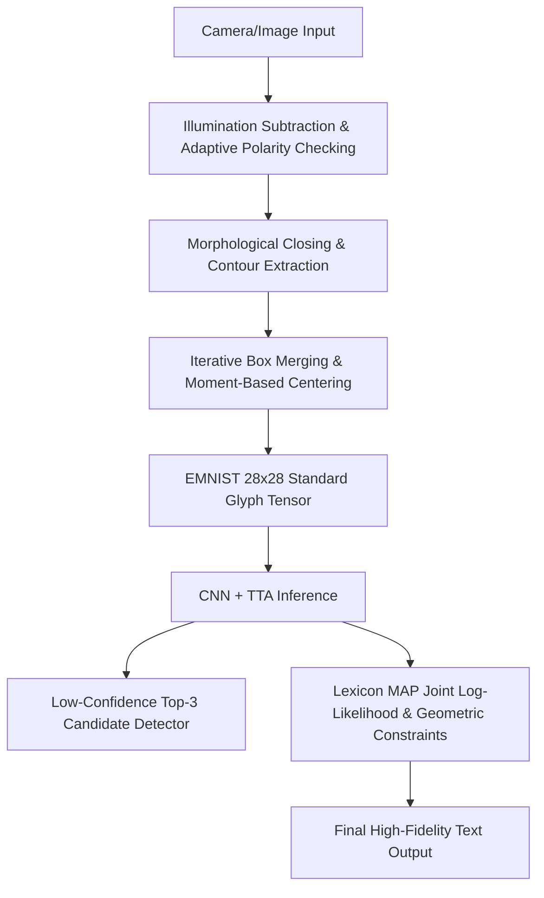

# Convolutional Neural Network-Based Handwritten Character Recognition and Intelligent Correction System
(基于卷积神经网络的手写体字符识别与智能纠错系统)

[简体中文](README.md) | [English](README_EN.md) | [日本語](README_JA.md)

---

## 🌟 1. System Overview & Technical Specifications

This system design implements an end-to-end handwritten character optical character recognition (OCR) and intelligent text spelling correction system. By utilizing a custom Convolutional Neural Network (CNN) to extract character morphological features, the system optimizes five core stages: front-end image acquisition, spatial character segmentation, neural network inference acceleration, post-processing language model spelling correction, and concurrent human-computer interaction.

### Core Modules & Technical Paths
* **Shadow Removal & Adaptive Polarity**: Implements a background illumination subtraction algorithm to eliminate uneven ambient lighting and shadows. An adaptive contrast polarity checking mechanism automatically handles both dark-on-light (paper ink) and light-on-dark (chalkboard writing) media.
* **Spatial Segmentation & Merging**: Applies a morphological closing stroke bridging operation on the binary image, combined with an iterative, multi-round bounding box merging mechanism (`should_merge` heuristics) and physical center-of-mass moment alignments. This resolves challenges like connected cursive writing, broken ink strokes, and multi-component glyphs (such as lowercase `i` and `j`).
* **Convolutional Network Inference**: Features a 3-layer convolutional block `HandwrittenCNN` utilizing a smooth SiLU (Swish) activation function and Kaiming normal weight initialization. Employs Test-Time Augmentation (TTA) multi-sampling fusion and model warm-up to optimize response speed.
* **Lexicon-Based Spelling Correction**: Employs a Maximum A Posteriori (MAP) joint log-likelihood lexicon decoder, combined with aspect ratio heuristics and intra-line relative height scaling to disambiguate visual homoglyphs (e.g., `0/O`, `1/I/l`, case mismatches).
* **Baidu OCR Reference Baseline**: Integrates the Baidu Cloud Handwriting OCR API as an external comparison baseline to evaluate the local custom model's recognition and correction performance during operation.
* **Asynchronous GUI Workstation**: Implements a responsive single-window dashboard in Tkinter driven by background thread pool asynchronous computing. This keeps the camera feed running smoothly at $30\text{ ms}$ while decoupling heavy local inference and remote API requests, supporting dynamic freeze-frame and live-stream hotkey switching.

---

## 🛠️ 2. Mathematical Modeling & Core Algorithmic Innovations

The system data processing and calculation pipeline is illustrated below:



### 2.1 Image Preprocessing & Adaptive Environment Adaptation

#### 2.1.1 Background Illumination Subtraction
Under physical webcam capture conditions, hands or phones often cast shadows, causing large black blotches when applying standard thresholding. The system handles this via a background illumination subtraction algorithm. It first estimates the local background ambient illumination using a large Gaussian smoothing kernel, and then compensates for shadows via matrix division.

The mathematical model is formulated as:
Let $I(x, y)$ denote the intensity of the input grayscale image at coordinates $(x, y)$. The background ambient illumination is estimated using a Gaussian smoothing kernel $G_{\sigma}$ with standard deviation $\sigma = 51$ as $B(x, y) = (G_{\sigma} \ast I)(x, y)$。The shadow-compensated normalized image intensity $I'(x, y)$ is defined as:
$$
I'(x, y) = \min \left( \frac{I(x, y)}{B(x, y)} \times 255, 255 \right)
$$
This division is executed as a parallel matrix operation using OpenCV to recover clean, shadow-free strokes.

#### 2.1.2 Adaptive Contrast Polarity Checking
To support both standard white paper (dark ink on a bright background) and dark chalkboards (bright chalk on a dark background) without manual buttons, the system extracts boundary pixels as background samples before character segmentation.
Let $\Omega$ represent the image domain and $\partial\Omega$ denote the outermost border region. The system computes the expected background intensity over the border region on the binarized image $T(x, y)$:
$$
\mu_{\text{bg}} = E_{(x, y) \in \partial\Omega}[T(x, y)]
$$
If $\mu_{\text{bg}} > 127$ (indicating a light background), it automatically inverts the image to align with the EMNIST neural network training format (white text on a black background):
$$
T'(x, y) = 255 - T(x, y)
$$
Otherwise, it preserves the polarity:
$$
T'(x, y) = T(x, y)
$$
This ensures automated environment adaptation.

---

### 2.2 Character Segmentation & Bounding Box Merging

#### 2.2.1 Morphological Closing for Stroke Bridging
Due to fine writing instruments or thresholding constraints, strokes often contain minute fractures. Running contour detection directly on such raw binary output would shatter a single letter. Therefore, the system applies a morphological Closing Operation on the polarity-corrected binary image $T'$ using a $2 \times 2$ rectangular structuring element $S$ before contour detection:
$$
T_c = (T' \oplus S) \ominus S
$$
where $\oplus$ and $\ominus$ denote dilation and erosion, respectively. This operation bridges fractures smaller than $2$ pixels and fills minor internal holes, enhancing character segmentation consistency.

#### 2.2.2 Iterative Bounding Box Merging
Traditional segmenters only perform a single sequential pass, which frequently misses disjoint parts of letters. This system implements an iterative bounding box merging algorithm that runs multiple rounds of a heuristic function until the number of boxes converges.
Let two bounding boxes be $B_1(x_1, y_1, w_1, h_1)$ and $B_2(x_2, y_2, w_2, h_2)$. They are merged based on the following criteria:
1. **Nesting Check**: If one box is nested almost entirely within another (with tolerance $\delta = 3$), they are merged.
2. **Vertical Grouping (Lowercase `i`, `j` dots)**: The horizontal overlap projection width ratio $O_x$ between $B_1$ and $B_2$ is computed. If $O_x > 0.4$, and the vertical gap $\Delta y$ satisfies:
   $$
   \Delta y < \max\left(15, 1.8 \cdot \min(h_1, h_2)\right)
   $$
   and the combined height does not exceed $2.2$ times the maximum height of the two boxes, they are merged.
3. **Horizontal Merging (Broken Pen Strokes)**: When the vertical overlap ratio $O_y > 0.5$, if the horizontal gap is $\Delta x \le 3$ pixels, or if $\Delta x \le 6$ pixels while one of the boxes is extremely narrow (width $\le 5$ pixels, signifying a stroke fragment), horizontal merging is triggered.

#### 2.2.3 Center-of-Mass Alignment (EMNIST Normalization)
To eliminate spatial shift noise, the system aligns the character based on Image Moments rather than simple bounding box centering.
We first calculate the zero-order moment $M_{00}$ and first-order moments $M_{10}, M_{01}$ of the binary character crop $I(x, y) \in \{0, 1\}$:
$$
M_{pq} = \sum_{x} \sum_{y} x^p y^q I(x, y)
$$
The centroid coordinates $(x_c, y_c)$ are defined as:
$$
x_c = \frac{M_{10}}{M_{00}}, \quad y_c = \frac{M_{01}}{M_{00}}
$$
The glyph is resized to $20 \times 20$ pixels and placed on a standard $28 \times 28$ canvas. We then apply an affine translation $(\Delta x, \Delta y)$:
$$
\begin{bmatrix} \Delta x \\ \Delta y \end{bmatrix} = \begin{bmatrix} 14.0 - x_c \\ 14.0 - y_c \end{bmatrix}
$$
shifting the center-of-mass precisely to $(14, 14)$, minimizing translation variances.

---

### 2.3 Convolutional Neural Network & Inference Optimization

#### 2.3.1 HandwrittenCNN Model Architecture
The network consists of three convolutional blocks followed by a dense classifier. Details are tabulated below:

| Stage | Layer Type | Input Shape | Output Shape | Parameters / Configurations |
| :--- | :--- | :--- | :--- | :--- |
| **Block 1** | Conv2d + BatchNorm2d + SiLU | $1 \times 28 \times 28$ | $32 \times 28 \times 28$ | Kernel $K=3$, Padding $P=1$, Stride $S=1$ |
| | MaxPool2d + Dropout2d | $32 \times 28 \times 28$ | $32 \times 14 \times 14$ | Pool size $2 \times 2$, Dropout $0.15$ |
| **Block 2** | Conv2d + BatchNorm2d + SiLU | $32 \times 14 \times 14$ | $64 \times 14 \times 14$ | Kernel $K=3$, Padding $P=1$, Stride $S=1$ |
| | MaxPool2d + Dropout2d | $64 \times 14 \times 14$ | $64 \times 7 \times 7$ | Pool size $2 \times 2$, Dropout $0.15$ |
| **Block 3** | Conv2d + BatchNorm2d + SiLU | $64 \times 7 \times 7$ | $128 \times 7 \times 7$ | Kernel $K=3$, Padding $P=1$, Stride $S=1$ (No pooling) |
| **Dense** | Flatten + Linear + SiLU + Dropout | 6272 | 512 | Dropout $0.5$ |
| **Output** | Linear | 512 | 62 | Outputs EMNIST 62 classes |

#### 2.3.2 Kaiming Normal Weight Initialization
To prevent gradient vanishing during the early stages of deep network training, Kaiming (He) normal initialization is applied to all convolutional layers:
$$
W \sim \mathcal{N}\left(0, \sigma^2\right), \quad \sigma = \sqrt{\frac{2}{n_{\text{in}}}}
$$
where $n_{\text{in}}$ denotes the number of input nodes. Linear dense layers are initialized using a normal distribution with mean 0 and standard deviation 0.01, with all biases set to 0.

#### 2.3.3 Test-Time Augmentation (TTA) Inference
To defend against prediction bias caused by handwriting variations, we incorporate TTA multi-sampling.
For any single character crop $x$, the system generates 11 spatial permutations. Let $T_k(x)$ ($k=1,\dots,11$) be the perturbed image under the $k$-th affine transformation (including 9 translations and 2 rotations).
These 11 variants are stacked as a batch and processed through the network. The final output is the averaged Softmax probability vector:
$$
P(y \mid x) = \frac{1}{11} \sum_{k=1}^{11} P_{\theta}(y \mid T_k(x))
$$
where $P_{\theta}(y \mid \cdot)$ represents the network's prediction probability distribution. This test-time integration mitigates noise and yields stable classification boundaries.

---

### 2.4 Multimodal Language-Level Spelling Correction

#### 2.4.1 Maximum A Posteriori (MAP) Lexicon Decoder
Confused handwritten pairs (such as `he11o` instead of `hello`) are a bottleneck for pure visual classifiers. When the system detects an alphabetical word context, it scores candidate words $W$ from a 10,000-word lexicon $D_L$ to find the optimal candidate $W^{\star}$:
$$
W^{\star} = \arg\max_{W \in D_L} \sum_{i=1}^{N} \ln \left( P(c_{i,\mathrm{lower}} \mid x_i) + P(c_{i,\mathrm{upper}} \mid x_i) \right)
$$
where $N$ is the word length, $x_i$ is the $i$-th segmented character image, and $c_{i,\mathrm{lower}}$ and $c_{i,\mathrm{upper}}$ denote the lowercase and uppercase candidate classes for the character at index $i$ in word $W$. Summing log-probabilities prevents float underflow and ensures stable scoring.

#### 2.4.2 Aspect Ratio Constraint for `0` vs `O/o`
For visually ambiguous characters like the digit `0` and letters `O/o`, the system applies a geometric prior based on the bounding box aspect ratio.
Let the width and height of the $i$-th character bounding box be $w_i$ and $h_i$, respectively. The aspect ratio $R_i$ is defined as:
$$
R_i = \frac{w_i}{h_i}
$$
Since hand-written zeros are statistically narrower than the letter O:
* If $R_i < 0.52$, we reward the probability of the digit `0` by multiplying it by $1.5$, and penalize `O` and `o` by multiplying their probabilities by $0.05$.
* If $R_i \ge 0.52$, the system shifts its confidence toward `O/o`.

#### 2.4.3 Intra-Line Relative Height Scaling for Casing
Case-symmetric letters (e.g., `C/c`, `O/o`, `S/s`, `Z/z` etc.) are disambiguated by computing the relative height $r_i$ of the glyph bounding box:
$$
r_i = \frac{h_i}{\max_{j=1}^N h_j}
$$
If $r_i < 0.78$ for a symmetric character, it is mapped to lowercase; otherwise, it remains uppercase.

---

### 2.5 External Integration: Baidu Handwriting OCR Reference Baseline

#### 2.5.1 Rationales for Integration
While the custom local model is highly optimized for character-level classification, benchmarking the overall text line segmentation and spell-correcting efficiency under realistic capture settings requires an objective baseline. Consequently, we integrated the Baidu Handwriting OCR API as an external comparison baseline.
* **Comparative Evaluation**: During execution, the UI displays outputs from the local raw CNN, the lexicon corrector, and the Baidu cloud OCR concurrently. This lets the developer evaluate the performance margins and limitations of our local segmentation and correction logic compared to a cloud baseline.
* **Redundancy Fallback**: Provides a backup text source in complex environments where local character contours overlap too severely.

#### 2.5.2 Implementation Mechanism
The API client is implemented in [src/baidu_ocr.py](file:///C:/Users/Liu/PycharmProjects/PythonProject3/src/baidu_ocr.py):
1. **OAuth 2.0 Token Caching**: Upon initialization, the client retrieves credentials from local configurations, requests and caches a 30-day Access Token.
2. **Image Encoding & HTTP POST**: When a recognition task starts, the system crops the designated ROI matrix, converts it into a Base64 string, and dispatches an HTTP POST request to the cloud handwriting endpoint.
3. **Async UI Rendering**: The client processes the JSON response in a background thread to retrieve the recognized text segments, updating the comparison card asynchronously.

---

## 📊 3. Model Training & Validation Performance

### 3.1 Loss Function & Optimization Hyperparameters
* **Label Smoothed Cross-Entropy Loss**:
  Let $y$ denote the true label, and $p(\cdot \mid x)$ be the predicted probability distribution for input $x$. With smoothing factor $\alpha = 0.1$ and class count $K = 62$, the label smoothed cross-entropy loss is defined as:
  $$
  L_{\mathrm{smooth}} = -(1 - \alpha) \log p(y \mid x) - \frac{\alpha}{K} \sum_{k=1}^K \log p(k \mid x)
  $$
  This softens target distributions to mitigate overconfidence and enhance the model's tolerance to noisy labels in handwriting EMNIST glyphs.
* **Optimizer**: Adam optimization with base learning rate $\eta_0 = 10^{-3}$ and weight decay regularizer $10^{-4}$ to constrain weight magnitude.
* **Scheduler & Early Stopping**: The scheduler halves the learning rate (Factor = 0.5) if validation loss plateaus for 3 consecutive epochs. Training terminates if validation accuracy fails to improve for 7 consecutive epochs.

### 3.2 Dataset Structure & Augmentations (get_dataloaders)
The dataset script is defined in [src/utils.py](file:///C:/Users/Liu/PycharmProjects/PythonProject3/src/utils.py):
* **Dataset**: EMNIST Balanced split containing 62 classes (10 digits, 26 uppercase, 26 lowercase) with 814,255 total samples.
* **Partitioning**: $90\%$ (628,138 samples) for training, $10\%$ (69,794 samples) for validation, and a distinct test set of 116,323 samples.
* **Academic Data Augmentations**:
  1. **Perspective Orientation**: $-90^{\circ}$ rotation and horizontal flip to reconstruct correct reading perspectives.
  2. **Random Affine**: rotation angle within $\pm 15^{\circ}$, translations up to $12\%$, scaling limits $0.8 \sim 1.2$, and shear angle up to $12^{\circ}$.
  3. **Perspective & Elastic Distortion**: perspective distortion coefficient of $0.2$ (probability $0.4$) and elastic deformation (coefficient $\alpha = 50.0$, probability $0.2$).
  4. **Noise & Blur**: Gaussian Blur (kernel size 3, probability $0.2$) and Random Erasing (masking area $2\% \sim 10\%$, probability $15\%$).

---

## ⚡ 4. UI Design & Asynchronous Concurrent Engineering

The GUI is built using Tkinter, providing a single-window dashboard.

### 4.1 Asynchronous Thread Pool Architecture
* **Problem**: Executing model inference and network API requests directly on the GUI thread suspends the window rendering, dropping frames and causing freeze warnings.
* **Solution**: The application detaches computations using a thread pool.
  * **Main GUI Thread**: Invokes a $30\text{ ms}$ periodic callback to read camera inputs, execute shadow subtraction and adaptive binarization, and display the webcam stream at $30\text{ FPS}$.
  * **Background Worker Thread**: When the user presses `Space`, the ROI is cloned and sent to a worker thread for CNN + TTA inference and Baidu OCR baseline requests. Callback hooks push the results back to the GUI once done, preventing interface lags.

### 4.2 Dynamic States (Live vs. Freeze Mode)
* **LIVE Mode**: Displays a green `LIVE` badge. Camera inputs and binarized visual maps render dynamically at $30\text{ FPS}$.
* **FREEZE Mode**: Pressing `Space` triggers a transition to `FREEZE` (orange badge). The camera stream locks. Cyan bounding boxes and indices are overlayed on the static ROI.
* **Unfreeze**: Pressing `Space`, `Enter`, `Esc`, or clicking `Resume` returns the UI to LIVE mode instantly.

---

## 📂 5. Repository Structure

```text
PythonProject3/
├── src/
│   ├── __init__.py
│   ├── model.py              # HandwrittenCNN neural network definition
│   ├── utils.py              # Data loader and data augmentation pipelines
│   ├── corrector.py          # Post-processing corrector (lexicon & geometric constraints)
│   ├── baidu_ocr.py          # Baidu cloud-based baseline OCR client
│   └── local_ocr.py          # Core local pipeline: pre-processing, morphology, and TTA inference
├── checkpoints/
│   ├── emnist_model.pth      # Pre-trained CNN model weights
│   ├── emnist_model_backup.pth # Stable backup file to prevent accidental overwrite
│   ├── data_augmentation_samples.png # [Auto-generated] Augmentation visual check
│   ├── training_curves.png           # [Auto-generated] Epoch loss & accuracy curve
│   └── confusion_matrix.png          # [Auto-generated] 62x62 confusion matrix heatmap
├── data/                     # Automatic download folder for EMNIST dataset
├── train.py                  # Training pipeline and asset generator
├── predict.py                # Offline test evaluation script
├── desktop_app.py            # Primary UI entry: multithreaded Tkinter dashboard
├── revert_model.py           # Weight recovery tool
├── README.md                 # Chinese Documentation
├── README_EN.md              # English Documentation
└── README_JA.md              # Japanese Documentation
```

---

## 🚀 6. Execution & Deployment Guide

### 6.1 Prerequisites
Run the following in Python 3.10:
```bash
pip install -r requirements.txt
```

To enable the optional Baidu OCR baseline comparison, export your credentials:
```powershell
$env:BAIDU_OCR_API_KEY = "Your_Baidu_API_Key"
$env:BAIDU_OCR_SECRET_KEY = "Your_Baidu_Secret_Key"
```

### 6.2 Running the GUI Application
Run the main script:
```bash
python desktop_app.py
```
* **Hot-swapping cameras (`C` Key)**: If multiple cameras are connected, press **`C`** while focusing on the window to cycle through active camera indices.
* **Capture and Recognize (Space Key)**: Put the paper containing handwritten text under the red focus box and press **【Space】**. The frame freezes, drawing cyan bounding boxes and indices.
* Results are displayed in the right sidebar:
  1. Local CNN raw output.
  2. Language corrected output.
  3. Baidu Cloud OCR output (if configured).
  4. Real-time binarized visual preview.
* Press **Space / Enter / Esc** to unfreeze and return to the live camera feed.
* Press **`B`** to toggle the cloud-based API reference.

### 6.3 Running Offline Evaluation
To test the lexicon decoder performance on simulated inputs, run:
```bash
python predict.py
```
This prints reports detailing corrections for misspelled sequences (like `he11o` -> `hello`) and spawns a Matplotlib window evaluating random EMNIST test batches.
