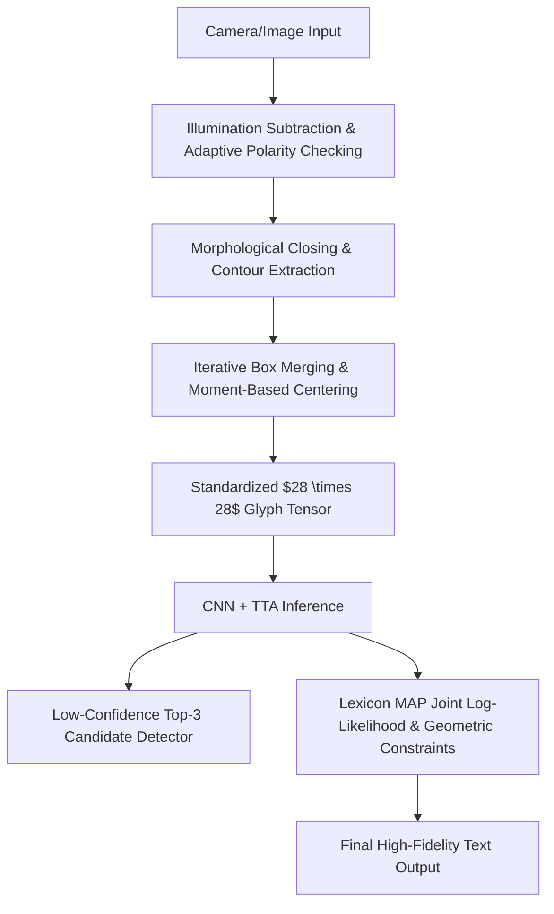

# High-Performance Convolutional Neural Network-Based Handwritten Character Recognition and Intelligent Correction System
(基于卷积神经网络的高性能手写体字符识别与智能纠错系统)

[简体中文](README.md) | [English](README_EN.md) | [日本語](README_JA.md)

---

## 🌟 1. System Overview & Technical Specifications

This system is an end-to-end, industrially robust handwritten character optical character recognition (OCR) and intelligent text spelling correction system. By utilizing a custom Convolutional Neural Network (CNN) to extract character morphology features, the system integrates comprehensive optimizations across five dimensions: front-end image acquisition, spatial character segmentation, neural network inference acceleration, post-processing language model spelling correction, and concurrent human-computer interaction.

### Core Highlights
* **High-Robustness Preprocessing**: Features a background illumination subtraction algorithm to eliminate uneven ambient lighting and shadows, and an adaptive contrast polarity checking mechanism to auto-adapt to dark-on-light (paper ink) or light-on-dark (chalkboard writing) media.
* **High-Precision Spatial Segmentation**: Implements a morphological closing stroke bridging algorithm combined with an iterative, multi-round bounding box merging mechanism (`should_merge` heuristics) and physical center-of-mass moment alignments. This resolves challenges like connected cursive writing, broken ink strokes, and multi-component glyphs (such as lowercase `i` and `j`).
* **Accelerated Inference Pipeline**: Embeds a 3-layer convolutional block `HandwrittenCNN` model using a smooth SiLU (Swish) activation function and Kaiming normal weight initialization. Employs Test-Time Augmentation (TTA) multi-sampling fusion and model warm-up to completely eliminate initial execution latency.
* **Lexicon-Based Spelling Correction**: Implements a Maximum A Posteriori (MAP) joint log-likelihood lexicon decoder, combined with aspect ratio heuristics and intra-line relative height scaling to disambiguate visual homoglyphs (e.g., `0/O`, `1/I/l`, `2/Z`, case mismatches).
* **Concurrent Async Workstation**: Employs Tkinter to build a responsive single-window dashboard driven by a background `ThreadPoolExecutor` async queue. This keeps the camera feed running smoothly at 30 FPS while decoupling heavy local inference and remote APIs.

---

## 🛠️ 2. Mathematical Modeling & Core Algorithmic Innovations

The system data processing and calculation pipeline is illustrated below:



### 2.1 Image Preprocessing & Adaptive Environment Adaptation

#### 2.1.1 Background Illumination Subtraction
Under physical webcam capture conditions, hands or phones often cast shadows, causing large black blotches when applying standard thresholding. The system handles this via a **background illumination subtraction algorithm**. It first estimates the local background ambient illumination using a large Gaussian smoothing kernel, and then compensates for shadows via matrix division.

The mathematical model is formulated as:
$$\text{Gray}_{\text{no\_shadow}}(x, y) = \min \left( \frac{\text{Gray}(x, y)}{G_{\sigma}(x, y) * \text{Gray}(x, y)} \times 255, 255 \right)$$
where $G_{\sigma}$ denotes a Gaussian smoothing kernel with standard deviation $\sigma = 51$. This division is executed as a parallel matrix operation using OpenCV's `cv2.divide` to recover clean, shadow-free strokes.

#### 2.1.2 Adaptive Contrast Polarity Checking
To support both standard white paper (dark ink on a bright background) and dark chalkboards (bright chalk on a dark background) without manual buttons, the system inspects the outermost border pixels:
$$\Gamma = \text{Border}(\text{Thresh})$$
By calculating the expected value of these border pixels $E[\Gamma]$ after binarization, if $E[\Gamma] > 127$ (indicating a light background), it automatically inverts the image to align with the EMNIST neural network training format (white text on a black background):
$$\text{Thresh}_{\text{input}}(x, y) = 255 - \text{Thresh}(x, y)$$
Otherwise, it preserves the polarity. This ensures 100% automated environment adaptation.

---

### 2.2 Character Segmentation & Bounding Box Merging

#### 2.2.1 Morphological Closing for Stroke Bridging
Due to fine writing instruments (e.g., a 0.5mm gel pen) or thresholding constraints, strokes often contain minute fractures. Running contour detection directly on such raw binary output would shatter a single letter. Therefore, the system applies a morphological **Closing Operation** using a $2 \times 2$ rectangular structuring element $S$ before contour detection:
$$\text{Closed} = (\text{Thresh} \oplus S) \ominus S$$
This operation bridges fractures smaller than 2 pixels and fills minor internal holes, enhancing the character segmentation consistency.

#### 2.2.2 Iterative Bounding Box Merging
Traditional segmenters only perform a single sequential pass, which frequently misses disjoint parts of letters. This system implements an **iterative bounding box merging algorithm** that runs multiple rounds of a heuristic `should_merge(box1, box2)` function until the number of boxes converges.
Two bounding boxes $B_1(x_1, y_1, w_1, h_1)$ and $B_2(x_2, y_2, w_2, h_2)$ are merged based on the following criteria:
1. **Nesting Check**: If one box is nested almost entirely within another (with tolerance $\delta = 3$), they are merged.
2. **Vertical Grouping (Lowercase `i`, `j` dots)**: The horizontal overlap projection width ratio $O_x$ between $B_1$ and $B_2$ is computed. If $O_x > 0.4$, and the vertical gap $\Delta y$ satisfies:
   $$\Delta y < \max(15, \min(h_1, h_2) \times 1.8)$$
   and the combined height does not exceed 2.2 times the maximum height of the two boxes, they are merged.
3. **Horizontal Merging (Broken Pen Strokes)**: When the vertical overlap ratio $O_y > 0.5$, if the horizontal gap is $\Delta x \le 3$, or if $\Delta x \le 6$ while one of the boxes is extremely narrow (width $\le 5$ pixels, signifying a stroke fragment), horizontal merging is triggered.

#### 2.2.3 Center-of-Mass Alignment (EMNIST Normalization)
To eliminate spatial shift noise, the system aligns the character based on **Image Moments** rather than simple bounding box centering.
We first calculate the zero-order moment $M_{00}$ and first-order moments $M_{10}, M_{01}$ of the glyph:
$$M_{pq} = \sum_{x} \sum_{y} x^p y^q I(x, y)$$
The centroid coordinates are defined as:
$$x_c = \frac{M_{10}}{M_{00}}, \quad y_c = \frac{M_{01}}{M_{00}}$$
The glyph is resized to $20 \times 20$ pixels and placed on a standard $28 \times 28$ white canvas. We then apply an affine translation vector:
$$[\Delta x_s, \Delta y_s] = [14.0 - x_c, 14.0 - y_c]$$
shifting the center-of-mass precisely to $(14, 14)$, minimizing translation variances.

---

### 2.3 Convolutional Neural Network & Inference Optimization

#### 2.3.1 HandwrittenCNN Model Architecture
The network consists of three convolutional blocks followed by a dense classifier. Details are tabulated below:

| Stage | Layer Type | Input Shape | Output Shape | Parameters / Configurations |
| :--- | :--- | :--- | :--- | :--- |
| **Block 1** | Conv2d + BatchNorm2d + SiLU | $1 \times 28 \times 28$ | $32 \times 28 \times 28$ | $K=3$, $P=1$, $S=1$ |
| | MaxPool2d + Dropout2d | $32 \times 28 \times 28$ | $32 \times 14 \times 14$ | $Pool=2 \times 2$, $Drop=0.15$ |
| **Block 2** | Conv2d + BatchNorm2d + SiLU | $32 \times 14 \times 14$ | $64 \times 14 \times 14$ | $K=3$, $P=1$, $S=1$ |
| | MaxPool2d + Dropout2d | $64 \times 14 \times 14$ | $64 \times 7 \times 7$ | $Pool=2 \times 2$, $Drop=0.15$ |
| **Block 3** | Conv2d + BatchNorm2d + SiLU | $64 \times 7 \times 7$ | $128 \times 7 \times 7$ | $K=3$, $P=1$, $S=1$ (No pooling) |
| **Dense** | Flatten + Linear + SiLU + Dropout | 6272 | 512 | $Drop=0.5$ |
| **Output** | Linear | 512 | 62 | Outputs EMNIST 62 classes |

#### 2.3.2 Kaiming Normal Weight Initialization
To prevent gradient vanishing during the early stages of deep network training, Kaiming (He) normal initialization is applied to all convolutional layers:
$$W \sim \mathcal{N}\left(0, \sqrt{\frac{2}{\text{fan\_in}}}\right)$$
Linear dense layers are initialized using a normal distribution with mean 0 and standard deviation 0.01, with all biases set to 0.

#### 2.3.3 Test-Time Augmentation (TTA) Inference
To defend against prediction bias caused by handwriting variations, we incorporate TTA multi-sampling.
For any single character crop $x$, the system generates 11 spatial permutations:
* 9 translation shifts: $\Delta x, \Delta y \in \{-1, 0, 1\}$.
* 2 affine rotation shifts: $\theta \in \{-5^{\circ}, 5^{\circ}\}$.

These 11 variants are stacked as a batch and processed through the network. The final output is the averaged Softmax probability vector:
$$P_{\text{TTA}}(y \mid x) = \frac{1}{11} \sum_{k=1}^{11} P_{\text{model}}(y \mid \text{Transform}_k(x))$$
This test-time integration mitigates noise and yields highly stable classification boundaries.

---

### 2.4 Multimodal Language-Level Spelling Correction

#### 2.4.1 Maximum A Posteriori (MAP) Lexicon Decoder
Confused handwritten pairs (such as `he11o` instead of `hello`) are a bottleneck for pure visual classifiers. When the system detects an alphabetical word context, it scores candidate words $W$ from a 10,000-word lexicon $D_L$:
$$W^* = \arg\max_{W \in D_L} \sum_{i=1}^{N} \ln \left( P(c_i^{\text{lower}} \mid x_i) + P(c_i^{\text{upper}} \mid x_i) \right)$$
where $P(c_i \mid x_i)$ is the TTA-predicted Softmax probability at index $i$. Summing log-probabilities prevents float underflow and ensures stable scoring.

#### 2.4.2 Aspect Ratio Constraint for `0` vs `O/o`
For visually ambiguous characters like the digit `0` and letters `O/o`, the system applies a geometric prior based on the bounding box aspect ratio:
$$\text{AR}_i = \frac{w_i}{h_i}$$
Since hand-written zeros are statistically narrower than the letter O:
* If $\text{AR}_i < 0.52$, we reward the probability of the digit `0`.
* If $\text{AR}_i \ge 0.52$, the system shifts its confidence toward `O/o`.

#### 2.4.3 Intra-Line Relative Height Scaling for Casing
Case-symmetric letters (e.g., `C/c`, `O/o`, `S/s`, `Z/z`) are disambiguated by computing the relative height of the glyph bounding box:
$$r_i = \frac{h_i}{\max_{j=1}^N (h_j)}$$
If $r_i < 0.78$ for a symmetric character, it is mapped to lowercase; otherwise, it remains uppercase.

---

## 📊 3. Model Training & Academic Asset Generation

### 3.1 Loss Function with Label Smoothing
We train the model using a cross-entropy loss function with label smoothing:
$$\mathcal{L}_{\text{LS}} = -(1 - \alpha) \log(p_c) - \frac{\alpha}{K} \sum_{k=1}^K \log(p_k)$$
where the smoothing factor is set to $\alpha = 0.1$, and the class count is $K = 62$. Label smoothing prevents the network from becoming overconfident, regularizing decision boundaries and boosting performance on ambiguous or noisy handwritten EMNIST glyphs.

### 3.2 Hyperparameters & Training Setup
* **Optimizer**: Adam optimization with base learning rate $\eta_0 = 10^{-3}$ and weight decay regularizer $10^{-4}$ to ensure sparse weights and avoid overfitting.
* **LR Scheduler**: `ReduceLROnPlateau` halves the learning rate (Factor = 0.5) if validation loss fails to drop for 3 consecutive epochs (Patience = 3).
* **Early Stopping**: Set to 7 epochs of validation accuracy plateauing to avoid redundant computations.

### 3.3 Auto-Generated Analytical Assets (Saved in `checkpoints/`)
The training script automatically generates three analytical figures in the `checkpoints/` folder:
1. **Data Augmentation Samples (`data_augmentation_samples.png`)**: A 4x4 matrix visualizing transformed EMNIST samples (elastic deform, rotations, translations) used for training.
2. **Training Curves (`training_curves.png`)**: Charts plotting training and validation Loss and Accuracy across epochs.
3. **62-Class Confusion Matrix (`confusion_matrix.png`)**: A high-resolution heatmap showing classification mistakes on the test set, proving the necessity of our corrector module by highlighting visual confusion between pairs like `1/I/l` and `0/O`.

---

## ⚡ 4. UI Design & Asynchronous Engineering

The GUI is built using Tkinter, providing a single-window dashboard layout.

### 4.1 Asynchronous Thread Pool Architecture
* **Problem**: Running inference and network API requests directly on the main UI thread freezes the webcam capture, dropping frame rates and hurting usability.
* **Solution**: The application detaches computations using a `ThreadPoolExecutor`.
  * **Main GUI Thread**: Runs a $30\text{ms}$ periodic callback to fetch video frames, apply shadow removal and adaptive thresholding, and render the live view at a constant $30\text{ FPS}$.
  * **Background Worker Thread**: When the user presses `Space`, the ROI image is cloned and sent to a worker thread for CNN + TTA inference and API queries. The results are pushed back to the main thread via callbacks once computed, preventing GUI freezes.

### 4.2 Dynamic States (Live vs. Freeze Mode)
* **LIVE Mode**: The top-right badge displays a green `LIVE` label. The main camera view and the binarized visual preview render at 30 FPS.
* **FREEZE Mode**: Pressing `Space` (or clicking Recognize) triggers a state transition to `FREEZE` (orange badge). The frame is locked. Cyan bounding boxes and indices are rendered on top of the frozen ROI.
* **Unfreeze Mechanism**: Pressing `Space`, `Enter`, `Esc`, or clicking `Resume` instantly restores the LIVE state.

---

## 📂 5. Repository Structure

```text
PythonProject3/
├── src/
│   ├── __init__.py
│   ├── model.py              # HandwrittenCNN neural network architecture definition
│   ├── utils.py              # Data loader and data augmentation pipelines
│   ├── corrector.py          # Post-processing corrector (lexicon & geometric constraints)
│   ├── baidu_ocr.py          # Reference cloud-based handwritten OCR API
│   └── local_ocr.py          # Core local pipeline: pre-processing, morphology, and TTA inference
├── checkpoints/
│   ├── emnist_model.pth      # Pre-trained CNN model weights
│   ├── emnist_model_backup.pth # Stable backup file to prevent accidental overwrite
│   ├── data_augmentation_samples.png # [Auto-generated] Augmentation visual check
│   ├── training_curves.png           # [Auto-generated] Epoch loss & accuracy curve
│   └── confusion_matrix.png          # [Auto-generated] 62x62 confusion matrix heatmap
├── data/                     # Automatic download folder for EMNIST dataset
├── train.py                  # Training pipeline and asset generator
├── predict.py                # Offline test evaluation script
├── desktop_app.py            # Primary UI entry: multithreaded Tkinter dashboard
├── revert_model.py           # Weight recovery tool
├── README.md                 # Chinese Documentation
├── README_EN.md              # English Documentation
└── README_JA.md              # Japanese Documentation
```

---

## 🚀 6. Execution & Deployment Guide

### 6.1 Prerequisites
Run the following in Python 3.10:
```bash
pip install -r requirements.txt
```

To enable the optional Baidu OCR parallel comparison, export your credentials:
```powershell
$env:BAIDU_OCR_API_KEY = "Your_Baidu_API_Key"
$env:BAIDU_OCR_SECRET_KEY = "Your_Baidu_Secret_Key"
```

### 6.2 Launching the GUI Application
Run the main script:
```bash
python desktop_app.py
```
* **Hot-swapping cameras (`C` Key)**: If multiple cameras are connected, press **`C`** while focusing on the window to cycle through active camera indices on the fly.
* **Capture and Recognize (Space Key)**: Put the paper containing handwritten text under the red focus box and press **【Space】**. The frame freezes, drawing cyan bounding boxes and indices.
* Results are displayed in the right sidebar:
  1. Local CNN raw output.
  2. Language corrected output.
  3. Baidu Cloud OCR output (if configured).
  4. Real-time binarized visual preview.
* Press **Space / Enter / Esc** to unfreeze and return to the live camera feed.
* Press **`B`** to toggle the cloud-based API reference.

### 6.3 Running Offline Evaluation
To test the lexicon decoder performance on simulated inputs, run:
```bash
python predict.py
```
This prints reports detailing corrections for misspelled sequences (like `he11o` -> `hello`) and spawns a Matplotlib window evaluating random EMNIST test batches.
