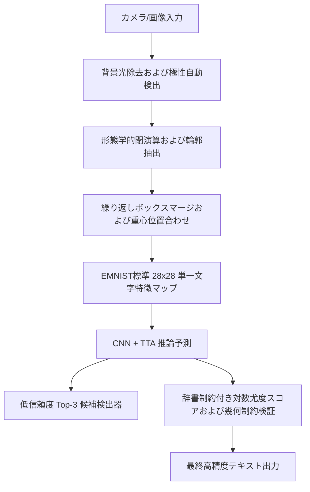

# 畳み込みニューラルネットワークに基づく手書き文字認識・知能修正システム
(Convolutional Neural Network-Based Handwritten Character Recognition and Intelligent Correction System)

[简体中文](README.md) | [English](README_EN.md) | [日本語](README_JA.md)

---

## 🌟 1. システム概要と主要技術指標

本システムは、エンドツーエンドの手書き文字認識（OCR）およびインテリジェントスペル修正システムです。カスタム畳み込みニューラルネットワーク（CNN）を用いて手書き文字の形状特徴を抽出し、画像前処理、空間文字分割、ニューラルネットワーク推論最適化、ポストプロセッシング言語モデルスペル修正、および非同期インタラクションの5つの主要プロセスにおいてアルゴリズムの最適化とアーキテクチャ設計を行っています。

### システムモジュールと技術経路
* **影除去と極性の自動適応**：不均一な光照や影の影響を排除する「背景照明差分補正アルゴリズム」を搭載。二値化後の外周ピクセルの分布を解析し、白紙（明るい背景に暗い文字）と黒板（暗い背景に明るい文字）の双方に自動適応する「極性自動検出」を採用しています。
* **空間分割とマージ**：輪郭抽出前に形態学的閉演算を適用して筆跡のかすれを接続し、さらに適応型「繰り返し境界ボックスマージアルゴリズム」と重心モーメント位置合わせを組み合わせることで、連筆やかすれ、`i`・`j` などの複数パーツ文字の分割エラーを修復します。
* **ニューラルネットワーク推論最適化**：3層畳み込みブロックからなる `HandwrittenCNN` を構築し、活性化関数に滑らかな SiLU (Swish)、重み初期化に Kaiming 基準を採用。推論時には TTA（テスト時データ拡張）マルチサンプリング融合とモデルウォームアップを導入し、システムの応答速度を最適化しました。
* **スペル自動修正**：英単語の文脈において、事後確率最大化（MAP）に基づく辞書対数尤度スコアリングを採用。アスペクト比の幾何検証や相対高さ比の解析と組み合わせることで、視覚的に混同しやすい手書き文字ペア（`0/O`、`1/I/l`、大小文字など）を自動修正します。
* **外部参照システム（コントロールグループ）**：百度クラウド手写 OCR 接口を比較基準として導入し、システム実行中にローカルモデルの認識率とスペル修正の有効性を客観的に評価できるようにしています。
* **非同期GUIダッシュボード**：Tkinter を使用して応答性の高いシングルウィンドウダッシュボードを構築。`ThreadPoolExecutor` を用いたスレッド処理により、カメラプレビューの 30 FPS 表示を維持しつつ、認識処理を非同期実行します。

---

## 🛠️ 2. 数学的モデリングとアルゴリズムの設計

システム全体のデータ処理および計算パイプラインは以下の通りです：



### 2.1 画像前処理と環境への自動適応

#### 2.1.1 背景照明差分除去アルゴリズム
実環境下でカメラを使用する場合、手やスマートフォンの影が写り込み、単純な二値化では広範囲 of 黒い汚れが発生します。本システムは背景照明差分除去アルゴリズムによりこの課題を解決します。まず大核ガウシアンフィルタを用いて背景の局所的な照度マップ（Illumination Map）を推定し、除算処理を行います。

数学モデルは以下のように定義されます：
$$\text{Gray}_{\text{no\_shadow}}(x, y) = \min \left( \frac{\text{Gray}(x, y)}{(G_{\sigma} \ast \text{Gray})(x, y)} \times 255, 255 \right)$$
ここで $G_{\sigma}$ は標準偏差 $\sigma = 51$ のガウス平滑化カーネルを表し、$\ast$ は畳み込み演算を示します。この除算は OpenCV の行列並列処理として実行され、影のない極めて鮮明な筆跡を抽出します。

#### 2.1.2 自動コントラスト極性検出
ユーザーによる手動切り替えを不要にするため、システムは文字分割の前に、画像の外周境界ピクセルを背景サンプルとして抽出します。
$\Omega$ を画像領域、$\partial\Omega$ を最も外側の境界領域とします。システムは、二値化画像 $T(x, y)$ の境界領域における背景強度の期待値を算出します：

$$
\mu_{\text{bg}} = E_{(x, y) \in \partial\Omega}[T(x, y)]
$$

もし $\mu_{\text{bg}} > 127$（背景が明るいと判定）の場合、文字特徴をニューラルネットワークの想定入力分布（黒背景に白文字）に合わせるため、画像の反転処理を行います：

$$
T'(x, y) = 255 - T(x, y)
$$

もし $\mu_{\text{bg}} \le 127$（背景が暗いと判定、例えば黒板など）の場合は、そのまま入力します：

$$
T'(x, y) = T(x, y)
$$

このアルゴリズムにより、様々な物理的筆記環境（紙や黒板など）に対する自動的な極性適応が実現されます。

---

### 2.2 文字分割および境界ボックスマージ

#### 2.2.1 形態学的閉演算による筆画橋接
手書きの筆圧不均一や二値化しきい値の偏りによって筆画が断裂することがあり、そのまま輪郭検出を行うと個々の文字が細切れに分割されてしまう原因になります。システムは、輪郭抽出を行う前に、極性補正後の二値化画像 $T'$ に対し $2 \times 2$ の矩形構造要素 $S$ を用いて閉演算（Closing Operation）を実行します：

$$
T_c = (T' \oplus S) \ominus S
$$

ここで $\oplus$ は膨張、$\ominus$ は収縮を表します。この操作により、筆画内部の微細な穴が埋められ、2画素未満の筆画の断裂が結合され、後続の輪郭抽出の連貫性が向上します。

#### 2.2.2 繰り返し境界ボックスマージ
従来の分割手法では単一方向の走査しか行わないため、隣接しないパーツの結合を見落としがちです。本システムは、適応型ルールを用いた繰り返しマージアルゴリズムを採用し、ボックスの個数が収束するまで複数ラウンドにわたって処理を実行します。
2つの境界ボックス $B_1(x_1, y_1, w_1, h_1)$ と $B_2(x_2, y_2, w_2, h_2)$ のマージルールは以下の通りです：
1. **入れ子包含判定**：一方のボックスが他方のボックスにほぼ完全に包含されている場合（許容誤差 $\delta = 3$）、自動的に結合します。
2. **垂直方向の再グループ化（英数字 `i` や `j` などの点とパーツの結合）**：$B_1$ と $B_2$ の $X$ 軸上における重複投影幅が、小さい方の幅に占める割合 $O_x$ を算出します。$O_x > 0.4$ かつ垂直方向の距離 $\Delta y$ が以下を満たす場合：

   $$
   \Delta y < \max\left(15, 1.8 \cdot \min(h_1, h_2)\right)
   $$

   さらにマージ後の総高さが両方の境界ボックスの最大高さの $2.2$ 倍を超えない場合、これらは同一文字（文字の点と本体など）であると判定され、マージされます。
3. **水平方向マージ（かすれ・断裂の修復）**：垂直方向の重複比率 $O_y > 0.5$ のとき、水平方向の間隔が $\Delta x \le 3$ ピクセル、または $\Delta x \le 6$ ピクセルでかつどちらか一方のボックス幅が極端に狭い（幅 $\le 5$ ピクセル、筆跡のかすれと判断される）場合、水平結合をトリガーします。

#### 2.2.3 重心モーメントによる位置合わせ（EMNIST特徴へのアライメント）
文字画像が境界ボックス内で偏っていることによる認識率への悪影響を排除するため、システムは画像の物理モーメント（Image Moments）に基づき、高精度な平移アライメントを行います。
まず、切り出された文字の二値画像 $I(x, y) \in \{0, 1\}$ に対し、0次モーメント $M_{00}$ および1次モーメント $M_{10}, M_{01}$ を算出します：

$$
M_{pq} = \sum_{x} \sum_{y} x^p y^q I(x, y)
$$

これにより、物理的な重心座標 $(x_c, y_c)$ が得られます：

$$
x_c = \frac{M_{10}}{M_{00}}, \quad y_c = \frac{M_{01}}{M_{00}}
$$

$20 \times 20$ 画素に縮小された文字画像を $28 \times 28$ 画素の標準キャンバス上に配置し、その重心とキャンバスの幾何中心 $(14.0, 14.0)$ との変位ベクトル $(\Delta x, \Delta y)$ を算出します。その後、アフィン変換行列を用いて画像を平行移動させて位置合わせを行います：

$$
\begin{bmatrix} \Delta x \\ \Delta y \end{bmatrix} = \begin{bmatrix} 14.0 - x_c \\ 14.0 - y_c \end{bmatrix}
$$

この重心アライメントにより、手書き文字特有の平行移動の偏りが排除されます。

---

### 2.3 畳み込みニューラルネットワークと推論最適化

#### 2.3.1 HandwrittenCNN モデル構造
ネットワークは、以下のように3つの畳み込みブロックと全結合分類器で構成されています：

| ステージ | レイヤータイプ | 入力サイズ | 出力サイズ | パラメータ / 設定 |
| :--- | :--- | :--- | :--- | :--- |
| **ブロック 1** | Conv2d + BatchNorm2d + SiLU | $1 \times 28 \times 28$ | $32 \times 28 \times 28$ | 畳み込み核 $K=3$, パディング $P=1$, ストライド $S=1$ |
| | MaxPool2d + Dropout2d | $32 \times 28 \times 28$ | $32 \times 14 \times 14$ | プーリング $2 \times 2$, ドロップアウト $0.15$ |
| **ブロック 2** | Conv2d + BatchNorm2d + SiLU | $32 \times 14 \times 14$ | $64 \times 14 \times 14$ | 畳み込み核 $K=3$, パディング $P=1$, ストライド $S=1$ |
| | MaxPool2d + Dropout2d | $64 \times 14 \times 14$ | $64 \times 7 \times 7$ | プーリング $2 \times 2$, ドロップアウト $0.15$ |
| **ブロック 3** | Conv2d + BatchNorm2d + SiLU | $64 \times 7 \times 7$ | $128 \times 7 \times 7$ | 畳み込み核 $K=3$, パディング $P=1$, ストライド $S=1$ (プーリングなし) |
| **全結合** | Flatten + Linear + SiLU + Dropout | 6272 | 512 | ドロップアウト $0.5$ |
| **出力** | Linear | 512 | 62 | EMNIST 62クラスの分類 |

#### 2.3.2 Kaiming Normal 重み初期化
深層ネットワークにおける初期の勾配消失を防ぎ、学習速度を向上させるため、すべての畳み込み層に Kaiming（He）正規分布初期化を適用します：

$$
W \sim \mathcal{N}\left(0, \sigma^2\right), \quad \sigma = \sqrt{\frac{2}{n_{\text{in}}}}
$$

ここで $n_{\text{in}}$ は入力チャネル数（ノード数）を示します。全結合層は平均 $0$、標準差 $0.01$ の正規分布で初期化し、バイアスはすべて $0$ に初期化します。

#### 2.3.3 テスト時データ拡張（TTA, Test-Time Augmentation）推論
手書き特有の筆跡のブレによる予測偏りを防ぎ、推論時に TTA 推論機構を導入しています。
単一文字入力 $x$ に対して、システムは空間変形により以下の計11個のバリエーションを並列生成します：
* 平行移動：$\Delta x, \Delta y \in \{-1, 0, 1\}$（計9パターン）。
* わずかな回転変形：$\theta \in \{-5^{\circ}, 5^{\circ}\}$（計2パターン）。

これら11個のバリエーションを Batch 次元でマージしてモデルに送り、それぞれの出力に対する Softmax 確率の平均値を最終予測確率とします：

$$
P(y \mid x) = \frac{1}{11} \sum_{k=1}^{11} P_{\theta}(y \mid T_k(x))
$$

ここで $P_{\theta}(y \mid \cdot)$ はパラメータ $\theta$ を持つネットワークモデルの出力確率分布を示し、$T_k(x)$ はアフィン変換を施した画像を指します。このテスト时アンサンブルによりノイズを効果的に平滑化し、識別器の抗噪性能を向上させます。

---

## 2.4 多次元インテリジェントスペル修正モジュール

#### 2.4.1 事後確率最大化（MAP）に基づく辞書尤度スコアリング
手書き類似文字（例：`hello` が CNN 単体で `he11o` や `he11O` と誤分類されるケース）は、純粋な視覚認識の限界です。本システムは、英単語の文字列と判定された場合に、常用英単語辞書 $D_L$（10,000語）の中から長さが一致する単語候補に対して尤度スコアリングを行います。

最も事後確率が高い単語 $W^{\star}$ は以下のように決定されます：

$$
W^{\star} = \arg\max_{W \in D_L} \sum_{i=1}^{N} \ln \left( P(c_{i,\mathrm{lower}} \mid x_i) + P(c_{i,\mathrm{upper}} \mid x_i) \right)
$$

ここで $N$ は単語の長さ、$x_i$ は分割された $i$ 番目の文字画像、$c_{i,\mathrm{lower}}$ および $c_{i,\mathrm{upper}}$ は単語 $W$ の $i$ 文字目に対応する小文字および大文字のカテゴリを示します。対数の和を計算することで、アンダーフローを防ぎ、安定した辞書校正が可能となります。

#### 2.4.2 縦横比による `0` と `O/o` の識別
形状が酷似した数字の `0` と英大文字の `O` について、境界ボックスのアスペクト比を用いた幾何学的先験ルールを導入しています。
分割された第 $i$ 番目の文字ボックスの幅を $w_i$、高さを $h_i$ としたとき、アスペクト比 $R_i$ を以下のように定義します：

$$
R_i = \frac{w_i}{h_i}
$$

手書き数字の `0` は縦長になりやすく、大文字の `O` は円に近くなります：
* $R_i < 0.52$ の場合、数字の `0` に対する確率に $1.5$ を乗算して重みを加え、`O` / `o` には $0.05$ を乗算してペナルティを課します。
* $R_i \ge 0.52$ の場合、英文字 `O` / `o` への割り振りを優先します。

#### 2.4.3 相対高さ比に基づく大小文字補正
字形が対称な文字（例：`C/c`, `O/o`, `S/s`, `Z/z` など）の誤認を防ぐため、文字列全体の中での相対高さ比 $r_i$ を統計処理します：

$$
r_i = \frac{h_i}{\max_{j=1}^N h_j}
$$

対称文字において、相対的な高さ比が $r_i < 0.78$ の場合は小文字に、それ以外の場合は大文字にマッピングすることで、大小文字の乱れを是正します。

---

### 2.5 外部システム：比較用「百度手書き文字 OCR」の統合

#### 2.5.1 導入理由（対照実験としての目的）
開発したローカル認識システムは単一文字の分類に優れた精度を持ちますが、実環境での連続テキストのセグメンテーションや、後処理によるスペル修正の性能を客観的に評価するために、外部の手書き文字 OCR 接口を対照グループとして導入しました。
* **精度比較**：ユーザーが認識をトリガーした際、ローカルの予測値、スペル修正後の出力、および外部 OCR の出力を同時に表示します。これにより、ローカルモデルと成熟したクラウドサービスとの差異を定量的に比較評価できます。
* **冗長性フォールバック**：筆跡が重なり合ってローカルの文字分割が困難な場合の予備データを提供します。

#### 2.5.2 導入と実装プロシージャ
接口は [src/baidu_ocr.py](file:///C:/Users/Liu/PycharmProjects/PythonProject3/src/baidu_ocr.py) にて実装されています：
1. **トークンの取得とキャッシュ**：アプリ起動時、クライアントが API キーとシークレットを取得し、OAuth 2.0 経由で Access Token を取得・キャッシュします。
2. **画像エンコードと送信**：認識開始時、切り出された領域の画像を圧縮エンコードして Base64 形式に変換し、リクエストを送信します。
3. **非同期リクエスト処理**：通信によるGUIの遅延を防ぐため、リクエスト処理はバックグラウンドスレッドプールで実行され、返されたデータからテキスト情報をパースして非同期でUIに反映します。

---

## 📊 3. モデル学習と評価

### 3.1 損失関数とオプティマイザの構成
* **ラベル平滑化損失関数**：
  $y$ を正解ラベル、入力 $x$ に対するモデルの予測確率分布を $p(\cdot \mid x)$ とします。平滑化係数 $\alpha = 0.1$、クラス数 $K = 62$ としたとき、ラベル平滑化クロスエントロピー損失 $L_{\mathrm{smooth}}$ は以下のように定義されます：

  $$
  L_{\mathrm{smooth}} = -(1 - \alpha) \log p(y \mid x) - \frac{\alpha}{K} \sum_{k=1}^K \log p(k \mid x)
  $$

  これにより、モデルが出力値に過剰適合するのを抑え、手書き文字データセット内のノイズによる過学習を抑制します。
* **パラメータ構成**：Adam オプティマイザ（学習率初始値 $\eta = 10^{-3}$、L2正則化の Weight Decay = $10^{-4}$）を適用。
* **学習率スケジューラと早期終了**：スケジューラを採用し、検証損失が3エポック連続で停滞した場合に学習率を半分にします。また、検証精度が7エポック連続で停滞した場合は自動的に学習を終了します。

### 3.2 データセット構造とデータ拡張 (get_dataloaders)
データローダは [src/utils.py](file:///C:/Users/Liu/PycharmProjects/PythonProject3/src/utils.py) にて定義されています：
* **データセット**：EMNIST Balanced データセット（62クラス、計 814,255 サンプル）を採用。
* **データ分割**：トレーニングデータ $90\%$（約 62.8万サンプル）、検証データ $10\%$（約 6.9万サンプル）、テストデータ 11.6万サンプル。
* **データ拡張手法**：
  1. **転置修復**：原始データの転置を $-90^{\circ}$ 回転および水平反転で修復。
  2. **アフィン変換**：角度 $\pm 15^{\circ}$ 内でのランダム回転、平移 $12\%$、縮放 $0.8 \sim 1.2$、シアー $12^{\circ}$。
  3. **透視と弾性変形**：透視変形（歪み $0.2$, 確率 $0.4$）および弾性変形（係数 $\alpha = 50.0$, 確率 $0.2$）を適用。
  4. **ノイズとブラー**：ガウシアンブラー（核サイズ $3$）とランダム消去（比率 $2\% \sim 10\%$）。

---

## ⚡ 4. UI設計と非同期並行処理

GUIには Tkinter を採用し、シングルウィンドウダッシュボードを構築しています。

### 4.1 非同期スレッドプール（ThreadPoolExecutor）の統合
* **課題**：画像認識処理やネットワーク API への同期型リクエストを GUI の描画と同一スレッドで処理すると、認識時にカメラ映像が数秒間フリーズする現象が発生します。
* **解決策**：スレッドプールを用いて計算処理をGUIスレッドからデカップリングしました。
  * **メインスレッド**：$30\text{ ms}$ 間隔でカメラフレームを読み込み、背景光除去と二値化処理を適用してリアルタイムで $30\text{ FPS}$ のプレビュー描画を継続。
  * **ワーカースレッド**：ユーザーがスペースキーを押すと、現在の関心領域（ROI）をコピーしてバックグラウンドで CNN + TTA 推論と API リクエストを処理。結果が得られ次第、コールバックを介してUIに反映するため、描画のカクつきは発生しません。

### 4.2 双方向状態マシン（Live / Freeze モード）
ユーザーが検出時の特徴を静止状態で詳細に観察できるよう、双方向の状態遷移を定義しています：
* **LIVE モード**：右上のステータスバッジが緑色の `LIVE` になり、映像と二値化画像が $30\text{ FPS}$ でリアルタイムに更新されます。
* **FREEZE モード**：スペースキーを押すと、ステータスが `FREEZE`（オレンジ色バッジ）に遷移し、映像フレームがロックされます。このとき、分割された各文字領域が青色の枠と番号（1, 2, 3...）で画像上にオーバーレイ表示されます。
* **解除方法**：`Space`, `Enter`, `Esc` キーまたは `Resume` ボタンのクリックで即座に LIVE モードに戻ります。

---

## 📂 5. プロジェクト構成

```text
PythonProject3/
├── src/
│   ├── __init__.py
│   ├── model.py              # HandwrittenCNN ネットワーク構造の定義
│   ├── utils.py              # データローダとデータ拡張の処理パイプライン
│   ├── corrector.py          # 后処理コレクタ（辞書尤度スコア & 幾何サイズ検証）
│   ├── baidu_ocr.py          # 比較用の百度手写 OCR 接口パッケージ
│   └── local_ocr.py          # ローカルパイプライン（前処理、閉演算、TTA推論ラッパー）
├── checkpoints/
│   ├── emnist_model.pth      # 学習済みニューラルネットワークモデルの重み
│   ├── emnist_model_backup.pth # バックアップ重みファイル（誤上書き防止）
│   ├── data_augmentation_samples.png # [自動生成] データ拡張の可視化画像
│   ├── training_curves.png           # [自動生成] 損失と精度のエポック収束推移
│   └── confusion_matrix.png          # [自動生成] 62クラスのテスト分類混同行列
├── data/                     # EMNIST データセットダウンロードフォルダ
├── train.py                  # トレーニング実行・図表アセット生成スクリプト
├── predict.py                # オフライン一括シミュレーションテストスクリプト
├── desktop_app.py            # アプリ起動入口：非同期マルチスレッドGUIダッシュボード
├── revert_model.py           # 復元ツール：バックアップモデル重みの復旧スクリプト
├── README.md                 # 简体中文マニュアル
├── README_EN.md              # 英語マニュアル
└── README_JA.md              # 日本語マニュアル
```

---

## 🚀 6. 実行・デプロイ手順

### 6.1 依存ライブラリのインストール
Python 3.10 environment にて以下を実行します：
```bash
pip install -r requirements.txt
```

比較用の百度 OCR API を有効にする場合は、環境変数（または `baiduocr/key.txt`）を設定します：
```powershell
$env:BAIDU_OCR_API_KEY = "Your_Baidu_API_Key"
$env:BAIDU_OCR_SECRET_KEY = "Your_Baidu_Secret_Key"
```

### 6.2 GUI ダッシュボードの起動
以下のコマンドでアプリケーションを起動します：
```bash
python desktop_app.py
```
* **カメラの切り替え (`C` キー)**：複数のカメラが接続されている場合、ウィンドウにフォーカスを当てて **`C` キー** を押すと、カメラインデックスが動的に切り替わります。
* **文字の切り出し・認識 (Space キー)**：手書きの文字を中央の赤枠内に配置して **【Space】** を押すと、画面が定格（FREEZE）し、青枠とインデックス番号で切り出された文字が表示されます。
* 右側の結果表示パネルには、上から順に以下が表示されます：
  1. ローカル CNN の生予測結果
  2. 辞書モデルと幾何検証を経た修正結果
  3. 百度クラウド OCR 予測結果（有効時）
  4. リアルタイム適応型二値化追跡マップ
* もう一度 **Space / Enter / Esc** を押すと、定格が解除されてリアルタイムプレビューに戻ります。
* **`B` キー** で、クラウド OCR 機能の有効・無効を切り替えられます。

### 6.3 オフラインスペル修正テストの実行
スペル修正アルゴリズムの予測性能をコンソールで検証する場合：
```bash
python predict.py
```
`he11o` などの混同スペルが `hello` に自動補正される過程がテストレポートとして出力され、EMNISTデータを用いた可視化評価ウィンドウが表示されます。
