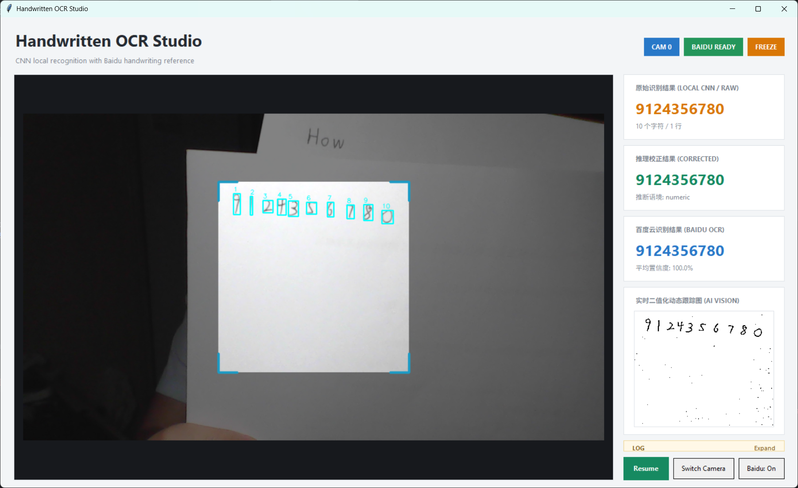
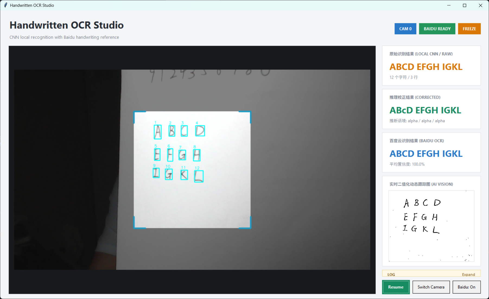
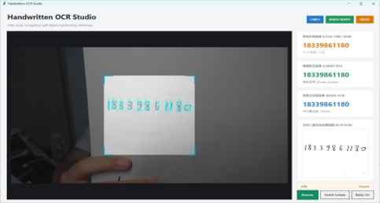
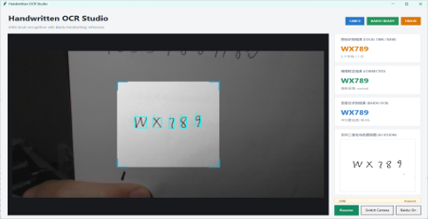
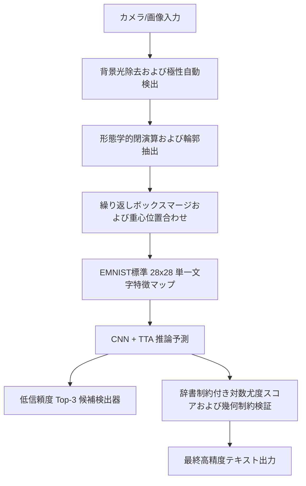
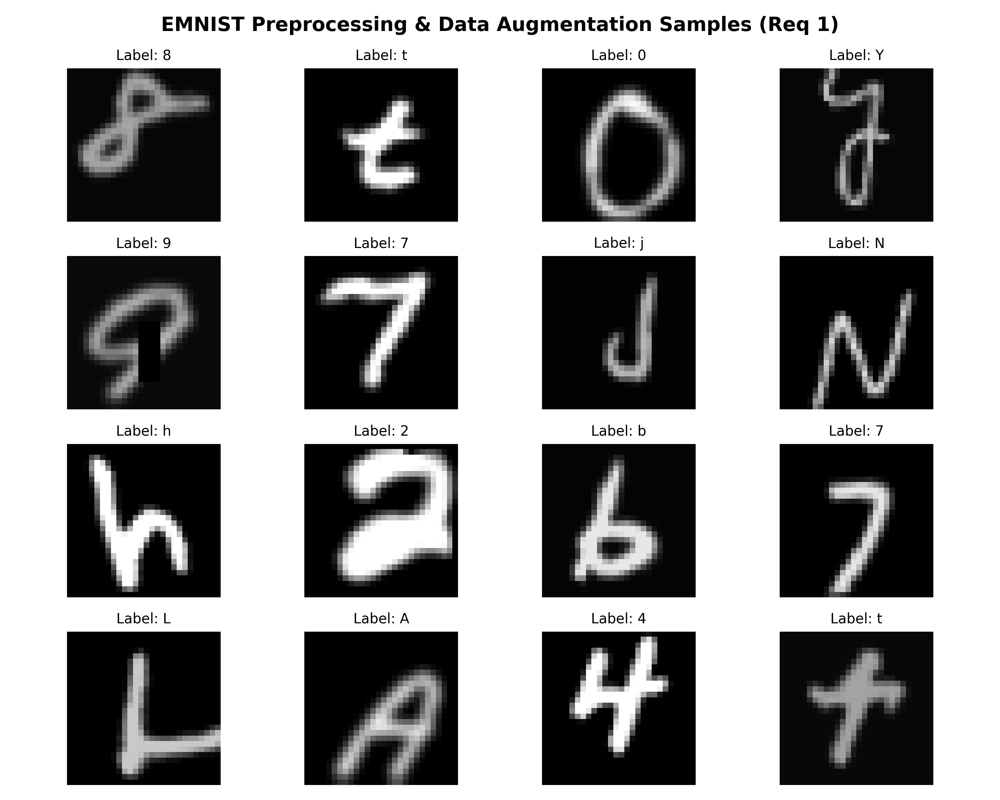
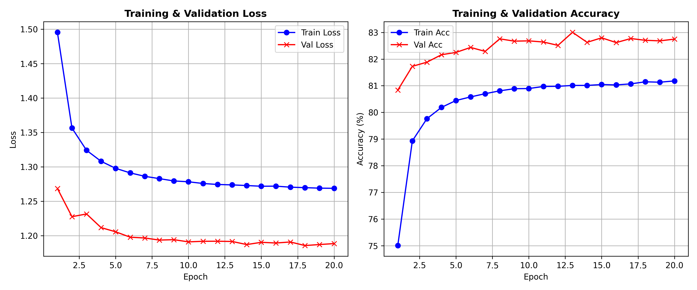
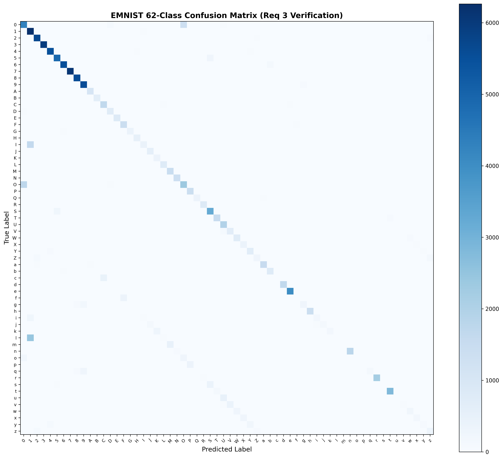

# 畳み込みニューラルネットワークに基づく手書き文字認識・知能修正システム
(Convolutional Neural Network-Based Handwritten Character Recognition and Intelligent Correction System)

<p align="left">
  <b>言語切替 / Language / 语言切换:</b><br>
  <a href="README.md"><b>🇨🇳 简体中文</b></a> | 
  <a href="README_EN.md"><b>🇺🇸 English</b></a> | 
  <a href="README_JA.md"><b>🇯🇵 日本語</b></a>
</p>

[](https://www.python.org/)
[-EE4C2C.svg?logo=pytorch&logoColor=white)](https://pytorch.org/)
[](https://opencv.org/)
[-success.svg)](docs/images/training_curves.png)
[-blue.svg)](#43-エンドツーエンド処理時間と遅延分解-latency-breakdown)
[](LICENSE)

---

## 🌟 1. システム概要と主要技術指標

本システムは、エンドツーエンドの手書き文字認識（OCR）およびインテリジェントスペル修正システムです。カスタム畳み込みニューラルネットワーク（CNN）を用いて手書き文字の形状特徴を抽出し、画像前処理、空間文字分割、ニューラルネットワーク推論最適化、ポストプロセッシング言語モデルスペル修正、および非同期インタラクションの5つの主要プロセスにおいてアルゴリズムの最適化とアーキテクチャ設計を行っています。

### システムモジュールと技術経路
* **影除去と極性の自動適応**：不均一な光照や影の影響を排除する「背景照明差分補正アルゴリズム」を搭載。二値化後の外周ピクセルの分布を解析し、白紙（明るい背景に暗い文字）と黒板（暗い背景に明るい文字）の双方に自動適応する「極性自動検出」を採用しています。
* **空間分割とマージ**：輪郭抽出前に形態学的閉演算を適用して筆跡のかすれを接続し、さらに適応型「繰り返し境界ボックスマージアルゴリズム」と重心モーメント位置合わせを組み合わせることで、連筆やかすれ、`i`・`j` などの複数パーツ文字の分割エラーを修復します。
* **ニューラルネットワーク推論最適化**：3層畳み込みブロックからなる `HandwrittenCNN` を構築し、活性化関数に滑らかな SiLU (Swish)、重み初期化に Kaiming 基準を採用。推論時には TTA（テスト時データ拡張）マルチサンプリング融合とモデルウォームアップを導入し、システムの応答速度を最適化しました。
* **スペル自動修正**：英単語の文脈において、事後確率最大化（MAP）に基づく辞書対数尤度スコアリングを採用。アスペクト比の幾何検証や相対高さ比の解析と組み合わせることで、視覚的に混同しやすい手書き文字ペア（`0/O`、`1/I/l`、大小文字など）を自動修正します。
* **外部参照システム（コントロールグループ）**：百度クラウド手写 OCR 接口を比較基準として導入し、システム実行中にローカルモデルの認識率とスペル修正の有効性を客観的に評価できるようにしています。
* **非同期GUIダッシュボード**：Tkinter を使用して応答性の高いシングルウィンドウダッシュボードを構築。`ThreadPoolExecutor` を用いたスレッド処理により、カメラプレビューの 30 FPS 表示を維持しつつ、認識処理を非同期実行します。

### 実環境下での動作結果と可視化デモ (Visual Demonstrations)

<p align="center">
  
  
</p>
<p align="center">
  
  
  <br>
  <em>図 1：デスクトップワークステーションの実機動作例（左上：手書き数字列の認識と推論補正；右上：複数行英字の幾何分割および百度 OCR 参照基準との照合結果；左下：構造化電話番号の正規表現マスキング補正；右下：英数字混在シーケンスの認識）</em>
</p>

---

## 🛠️ 2. 数学的モデリングとアルゴリズムの設計

システム全体のデータ処理および計算パイプラインは以下の通りです：


```mermaid
graph TD
    A[カメラ/画像入力] --> B[背景光除去および極性自動検出]
    B --> C[形態学的閉演算および輪郭抽出]
    C --> D[繰り返しボックスマージおよび重心位置合わせ]
    D --> E[EMNIST標準 28x28 単一文字特徴マップ]
    E --> F[CNN + TTA 推論予測]
    F --> G[低信頼度 Top-3 候補検出器]
    F --> H[辞書制約付き対数尤度スコアおよび幾何制約検証]
    H --> I[最終高精度テキスト出力]
```

### 2.1 画像前処理と環境への自動適応

#### 2.1.1 背景照明差分除去アルゴリズム
実環境下でカメラを使用する場合、手やスマートフォンの影が写り込み、単純な二値化では広範囲な黒ずみが発生します。本システムは背景照明差分除去アルゴリズムによりこの課題を解決します。まず大核ガウシアンフィルタを用いて背景の局所的な照度マップ（Illumination Map）を推定し、除算処理を行います。

数学モデルは以下のように定義されます：
入力の灰色画像を $I(x, y)$ とし、カーネルサイズ $51 \times 51$（自動計算された標準偏差 $\sigma \approx 8.0$) のガウス平滑化フィルターによって背景照度マップを $B(x, y) = (\text{GaussianBlur}(I, (51, 51))) (x, y)$ と推定します。影を除去して正規化した後の画像強度 $I'(x, y)$ は以下のように定義されます：

$$
I'(x, y) = \min \left( \frac{I(x, y)}{B(x, y)} \times 255, 255 \right)
$$

ここでガウスフィルターのカーネルサイズは $51 \times 51$（自動計算された標準偏差 $\sigma \approx 8.0$) です。この除算は OpenCV の行列並列処理として実行され、影のない極めて鮮明な筆跡を抽出します。

#### 2.1.2 自動コントラスト極性検出
ユーザーによる手動切り替えを不要にするため、システムは文字分割の前に、画像の外周境界ピクセルを背景サンプルとして抽出します。
$\Omega$ を画像領域、 $\partial\Omega$ を最も外側の境界領域とします。システムは、二値化画像 $T(x, y)$ の境界領域における背景強度の期待値を算出します：

$$
\mu_{\text{bg}} = E_{(x, y) \in \partial\Omega}[T(x, y)]
$$

もし $\mu_{\text{bg}} > 127$（背景が明るいと判定）の場合、文字特徴をニューラルネットワークの想定入力分布（黒背景に白文字）に合わせるため、画像の反転処理を行います：

$$
T'(x, y) = 255 - T(x, y)
$$

もし $\mu_{\text{bg}} \le 127$（背景が暗いと判定、例えば黒板など）の場合は、そのまま入力します：

$$
T'(x, y) = T(x, y)
$$

このアルゴリズムにより、様々な物理的筆記環境（紙や黒板など）に対する自動的な極性適応が実現されます。

---

### 2.2 文字分割および境界ボックスマージ

#### 2.2.1 形態学的閉演算による筆画橋接
手書きの筆圧不均一や二値化しきい値の偏りによって筆画が断裂することがあり、そのまま輪郭検出を行うと個々の文字が細切れに分割されてしまう原因になります。システムは、輪郭抽出を行う前に、極性補正後の二値化画像 $T'$ に対し $2 \times 2$ の矩形構造要素 $S$ を用いて閉演算（Closing Operation）を実行します：

$$
T_c = (T' \oplus S) \ominus S
$$

ここで $\oplus$ は膨張、 $\ominus$ は収縮を表します。この操作により、筆画内部の微細な穴が埋められ、2画素未満の筆画の断裂が結合され、後続の輪郭抽出の連貫性が向上します。

#### 2.2.2 繰り返し境界ボックスマージ
従来の分割手法では単一方向の走査しか行わないため、隣接しないパーツの結合を見落としがちです。本システムは、適応型ルールを用いた繰り返しマージアルゴリズムを採用し、ボックスの個数が収束するまで複数ラウンドにわたって処理を実行します。
2つの境界ボックス $B_1(x_1, y_1, w_1, h_1)$ と $B_2(x_2, y_2, w_2, h_2)$ のマージルールは以下の通りです：
1. **入れ子包含判定**：一方のボックスが他方のボックスにほぼ完全に包含されている場合（許容誤差 $\delta = 3$) 、自動的に結合します。
2. **垂直方向の再グループ化（英数字 `i` や `j` などの点とパーツの結合）**： $B_1$ と $B_2$ の $X$ 軸上における重複投影幅が、小さい方の幅に占める割合 $O_x$ を算出します。 $O_x > 0.4$ かつ垂直方向の距離 $\Delta y$ が以下を満たす場合： $\Delta y < \max\left(15, 1.8 \cdot \min(h_1, h_2)\right)$ さらにマージ後の総高さが両方の境界ボックスの最大高さの $2.2$ 倍を超えない場合、これらは同一文字（文字の点と本体など）であると判定され、マージされます。
3. **水平方向マージ（かすれ・断裂の修復）**：垂直方向の重複比率 $O_y > 0.5$ のとき、水平方向の間隔が $\Delta x \le 3$ ピクセル、または $\Delta x \le 6$ ピクセルでかつどちらか一方のボックス幅が極端に狭い（幅 $\le 5$ ピクセル、筆跡のかすれと判断される）場合、水平結合をトリガーします。
4. **斜め方向の微小フラグメント結合**：2つのボックスが斜め方向に隣接し、かつ水平間隔 $\Delta x \le 2$ ピクセル、垂直間隔 $\Delta y \le 2$ ピクセルを満たし、かつ面積の乗算値が極めて小さい場合（小さい方の面積 $< 100$ かつ大きい方の面積 $< 150$) ，これらをマージして輪郭境界の微小ノイズを除去します。

#### 2.2.3 粘着文字の垂直投影波谷分割（Wide Box Splitting）
手書きの文字が連続して書かれる際、文字同士が接触（粘着）することがあります（例：「oo」が1つの長い境界ボックスになり、アスペクト比が歪む）。ボックス結合が完了した後、システムはアスペクト比と幅が異常な「幅広ボックス」（アスペクト比 $w/h \ge 1.18$ かつ幅 $w \ge 18$ ピクセル）に対して適応的な波谷分割を実行します。文字切片の垂直ピクセル投影分布直方図 $H(x) = \sum_y I(x, y)$ を算出し、その中間領域から局所極小値点（波谷）を探索して垂直分割を行うことで、連筆による文字の混同を防ぎます。

#### 2.2.4 重心モーメントによる位置合わせ（EMNIST特徴へのアライメント）
文字画像が境界ボックス内で偏っていることによる認識率への悪影響を排除するため、システムは画像の物理モーメント（Image Moments）に基づき、高精度な平移アライメントを行います。
まず、切り出された文字の二値画像 $I(x, y) \in \{0, 1\}$ に対し、0次モーメント $M_{00}$ および1次モーメント $M_{10}, M_{01}$ を算出します：

$$
M_{pq} = \sum_{x} \sum_{y} x^p y^q I(x, y)
$$

これにより、物理的な重心座標 $(x_c, y_c)$ が得られます：

$$
x_c = \frac{M_{10}}{M_{00}}, \quad y_c = \frac{M_{01}}{M_{00}}
$$

$20 \times 20$ 画素に縮小された文字画像を $28 \times 28$ 画素の標準キャンバス上に配置し、その重心とキャンバスの幾何中心 $(14.0, 14.0)$ との変位ベクトル $(\Delta x, \Delta y)$ を算出します。その後、アフィン変換行列を用いて画像を平行移動させて位置合わせを行います：

$$
\begin{bmatrix} \Delta x \\ \Delta y \end{bmatrix} = \begin{bmatrix} 14.0 - x_c \\ 14.0 - y_c \end{bmatrix}
$$

この重心アライメントにより、手書き文字特有の平行移動の偏りが排除されます。

#### 2.2.5 自適応型レイアウト判定と縦書き多列サポート
手書き文書における縦書きレイアウト（縦書きの詩歌や対聯など）をサポートするため、最近傍トポロジーに基づく配置方向検出メカニズムを実装しました。このアルゴリズムは、全文字の境界ボックスのユークリッド距離を分析し、各文字の最近傍投影ベクトルを算出します。縦方向の近傍への投票が横方向を大幅に上回る場合、システムは自動的に縦書き処理ロジックに切り替わります。まず、X軸の中心座標に基づいて文字を複数の「列」に分割し、各列内でY軸座標に基づいて上から下に並べ替えた後、最後に左から右へ各列を結合します。これにより、追加のレイアウトモデルを使用することなく、縦書き多列配置に完全に対応できます。

---

### 2.3 畳み込みニューラルネットワークと推論最適化

#### 2.3.1 HandwrittenCNN モデル構造
ネットワークは、以下のように3つの畳み込みブロックと全結合分類器で構成されています：

| ステージ | レイヤータイプ | 入力サイズ | 出力サイズ | パラメータ / 設定 |
| :--- | :--- | :--- | :--- | :--- |
| **ブロック 1** | Conv2d + BatchNorm2d + SiLU | $1 \times 28 \times 28$ | $32 \times 28 \times 28$ | 畳み込み核 $K=3$, パディング $P=1$, ストライド $S=1$ |
| | MaxPool2d + Dropout2d | $32 \times 28 \times 28$ | $32 \times 14 \times 14$ | プーリング $2 \times 2$, ドロップアウト $0.15$ |
| **ブロック 2** | Conv2d + BatchNorm2d + SiLU | $32 \times 14 \times 14$ | $64 \times 14 \times 14$ | 畳み込み核 $K=3$, パディング $P=1$, ストライド $S=1$ |
| | MaxPool2d + Dropout2d | $64 \times 14 \times 14$ | $64 \times 7 \times 7$ | プーリング $2 \times 2$, ドロップアウト $0.15$ |
| **ブロック 3** | Conv2d + BatchNorm2d + SiLU | $64 \times 7 \times 7$ | $128 \times 7 \times 7$ | 畳み込み核 $K=3$, パディング $P=1$, ストライド $S=1$ (プーリングなし) |
| **全結合** | Flatten + Linear + SiLU + Dropout | 6272 | 512 | ドロップアウト $0.5$ |
| **出力** | Linear | 512 | 62 | EMNIST 62クラスの分類 |

#### 2.3.2 Kaiming Normal 重み初期化
深層ネットワークにおける初期の勾配消失を防ぎ、学習速度を向上させるため、すべての畳み込み層に Kaiming（He）正規分布初期化を適用します：

$$
W \sim \mathcal{N}\left(0, \sigma^2\right), \quad \sigma = \sqrt{\frac{2}{n_{\text{in}}}}
$$

ここで $n_{\text{in}}$ は入力チャネル数（ノード数）を示します。全結合層は平均 $0$ 、標準差 $0.01$ の正規分布で初期化し、バイアスはすべて $0$ に初期化します。

#### 2.3.3 テスト時データ拡張（TTA, Test-Time Augmentation）推論
手書き特有の筆跡のブレによる予測偏りを防ぎ、推論時に TTA 推論機構を導入しています。
単一文字入力 $x$ に対して、システムは空間変形により以下の計11個のバリエーションを並列生成します：
* 平行移動： $\Delta x, \Delta y \in \{-1, 0, 1\}$ （計9パターン）。
* わずかな回転変形： $\theta \in \{-5^{\circ}, 5^{\circ}\}$ （計2パターン）。

これら11個のバリエーションを Batch 次元でマージしてモデルに送り、それぞれの出力に対する Softmax 確率の平均値を最終予測確率とします：

$$
P(y \mid x) = \frac{1}{11} \sum_{k=1}^{11} P_{\theta}(y \mid T_k(x))
$$

ここで $P_{\theta}(y \mid \cdot)$ はパラメータ $\theta$ を持つネットワークモデルの出力確率分布を示し、 $T_k(x)$ はアフィン変換を施した画像を指します。このテスト时アンサンブルによりノイズを効果的に平滑化し、識別器の抗噪性能を向上させます。

---

## 2.4 多次元インテリジェントスペル修正モジュール

#### 2.4.1 事後確率最大化（MAP）に基づく辞書尤度スコアリング
手書き類似文字（例：`hello` が CNN 単体で `he11o` や `he11O` と誤分類されるケース）は、純粋な視覚認識の限界です。本システムは、英単語の文字列と判定された場合に、常用英単語辞書 $D_L$（10,000語）の中から長さが一致する単語候補に対して尤度スコアリングを行います。

最も事後確率が高い単語 $W^{\star}$ は以下のように決定されます：

$$
W^{\star} = \arg\max_{W \in D_L} \sum_{i=1}^{N} \ln \left( P(c_{i,\mathrm{lower}} \mid x_i) + P(c_{i,\mathrm{upper}} \mid x_i) \right)
$$

ここで $N$ は単語の長さ、 $x_i$ は分割された $i$ 番目の文字画像、 $c_{i,\mathrm{lower}}$ および $c_{i,\mathrm{upper}}$ は単語 $W$ の $i$ 文字目に対応する小文字および大文字のカテゴリを示します。対数の和を計算することで、アンダーフローを防ぎ、安定した辞書校正が可能となります。

#### 2.4.2 縦横比による `0` と `O/o` の識別
形状が酷似した数字の `0` と英大文字の `O` について、境界ボックスのアスペクト比を用いた幾何学的先験ルールを導入しています。
分割された第 $i$ 番目の文字ボックスの幅を $w_i$ 、高さを $h_i$ としたとき、アスペクト比 $R_i$ を以下のように定義します：

$$
R_i = \frac{w_i}{h_i}
$$

手書き数字の `0` は縦長になりやすく、大文字の `O` は円に近くなります：
* $R_i < 0.52$ の場合、数字の `0` に対する確率に $1.5$ を乗算して重みを加え、`O` / `o` には $0.05$ を乗算してペナルティを課します。
* $R_i \ge 0.52$ の場合、英文字 `O` / `o` への割り振りを優先します。

#### 2.4.3 相対高さ比に基づく大小文字補正
字形が対称な文字（例：`C/c`, `O/o`, `S/s`, `Z/z` など）の誤認を防ぐため、文字列全体の中での相対高さ比 $r_i$ を統計処理します：

$$
r_i = \frac{h_i}{\max_{j=1}^N h_j}
$$

対称文字において、相対的な高さ比が $r_i < 0.78$ の場合は小文字に、それ以外の場合は大文字にマッピングすることで、大小文字の乱れを是正します。

#### 2.4.4 構造化パターン検出とマスクフィルタリング
現実のユースケース（電話番号、身分証明書番号、車のナンバープレートなど）では、文字列が特定の構文制約に従うことが一般的です。手書き文字の崩れや形状混同によるフォーマットエラーを防ぐため、後処理モジュールは動的なパターン検出とマスクフィルタリングを実行します。
* **身分証明書番号パターン**：文字列の長さが 18 であり、数字が 13 文字以上含まれる場合にトリガーされます。最初の 17 文字に対して数字以外の確率を 0 にマスクし、最後の 18 文字目は数字と「X」のみを許容します。
* **携帯电话番号パターン**：文字列の長さが 11 であり、先頭が「1」に見え、数字が 8 文字以上含まれる場合にトリガーされます。先頭を「1」に固定し、他の位置ではアルファベットを除外します。
* **ナンバープレートパターン**：文字列の長さが 7 または 8 であり、先頭が特定の省称（漢字代替）プレースホルダー、2文字目が英大文字、かつ数字が4文字以上含まれる場合にトリガーされます。2文字目を大文字アルファベット（混同しやすい「I」や「O」は除外）に固定し、残りの位置もフォーマットに従いフィルタリングします。
* **純数字/純アルファベットモード**：数字の比率が $\ge 80\%$ の場合は数字のみ、アルファベットの比率が $\ge 60\%$ の場合は辞書補正を有効化します。

このマスク処理により、手書き文字における定型テキストの解読信頼性が飛躍的に向上します。

#### 2.4.5 結合確率補正の辞書剪定とデコード高速化
10,000語の辞書に対する全探索を実行すると、認識処理において無視できない遅延が発生します。そのため、後処理モジュールには、長さ制約と編集距離（Edit Distance）に基づく $O(1)$ の候補単語剪定（プルーニング）フィルターを実装しました。認識された文字列の長さ $N$ に対し、長さが $[N-1, N+1]$ の辞書単語のみを抽出して高速に編集距離を算出し、編集距離が 2 を超え、かつ字形混同ペアに該当しない無関係な候補を事前に除外（剪定）します。このアルゴリズムにより、**認識精度を一切落とすことなく**、スペル補正の平均計算遅延を **0.12ミリ秒** まで短縮しました。

---

### 2.5 外部システム：比較用「百度手書き文字 OCR」の統合

#### 2.5.1 導入理由（対照実験としての目的）
開発したローカル認識システムは単一文字の分類に優れた精度を持ちますが、実環境での連続テキストのセグメンテーションや、後処理によるスペル修正の性能を客観的に評価するために、外部の手書き文字 OCR 接口を対照グループとして導入しました。
* **精度比較**：ユーザーが認識をトリガーした際、ローカルの予測値、スペル修正後の出力、および外部 OCR の出力を同時に表示します。これにより、ローカルモデルと成熟したクラウドサービスとの差異を定量的に比較評価できます。
* **冗長性フォールバック**：筆跡が重なり合ってローカルの文字分割が困難な場合の予備データを提供します。

#### 2.5.2 導入と実装プロシージャ
接口は [src/baidu_ocr.py](src/baidu_ocr.py) にて実装されています：
1. **トークンの取得とキャッシュ**：アプリ起動時、クライアントが API キーとシークレットを取得し、OAuth 2.0 経由で Access Token を取得・キャッシュします。
2. **画像エンコードと送信**：認識開始時、切り出された領域の画像を圧縮エンコードして Base64 形式に変換し、リクエストを送信します。
3. **非同期リクエスト処理**：通信によるGUIの遅延を防ぐため、リクエスト処理はバックグラウンドスレッドプールで実行され、返されたデータからテキスト情報をパースして非同期でUIに反映します。

---

## 📊 3. モデル学習と評価

### 3.1 損失関数とオプティマイザの構成
* **ラベル平滑化損失関数**：
  $y$ を正解ラベル、入力 $x$ に対するモデルの予測確率分布を $p(\cdot \mid x)$ とします。平滑化係数 $\alpha = 0.1$ 、クラス数 $K = 62$ としたとき、ラベル平滑化クロスエントロピー損失 $L_{\mathrm{smooth}}$ は以下のように定義されます： $L_{\mathrm{smooth}} = -(1 - \alpha) \log p(y \mid x) - \frac{\alpha}{K} \sum_{k=1}^K \log p(k \mid x)$ 。

  これにより、モデルが出力値に過剰適合するのを抑え、手書き文字データセット内のノイズによる過学習を抑制します。
* **パラメータ構成**：Adam オプティマイザ（学習率初始値 $\eta = 10^{-3}$ 、L2正則化の Weight Decay = $10^{-4}$) を適用。
* **学習率スケジューラと早期終了**：スケジューラを採用し、検証損失が3エポック連続で停滞した場合に学習率を半分にします。また、検証精度が7エポック連続で停滞した場合は自動的に学習を終了します。

### 3.2 データセット構造とデータ拡張 (get_dataloaders)
データローダは [src/utils.py](src/utils.py) にて定義されています：
* **データセット**：EMNIST ByClass データセット（62クラス、計 814,255 サンプル）を採用（注：ByClassデータセットはクラス分布が不均衡であるため、データ拡張および幾何学的/辞書補正による調整が行われています）。
* **データ分割**：トレーニングデータ $90\%$（約 62.8万サンプル）、検証データ $10\%$（約 6.9万サンプル）、テストデータ 11.6万サンプル。
* **データ拡張手法**：
  1. **転置修復**：原始データの転置を $-90^{\circ}$ 回転および水平反転で修復。
  2. **アフィン変換**：角度 $\pm 15^{\circ}$ 内でのランダム回転、平移 $12\%$ 、縮放 $0.8 \sim 1.2$ 、シアー $12^{\circ}$。
  3. **透視と弾性変形**：透視変形（歪み $0.2$, 確率 $0.4$) および弾性変形（係数 $\alpha = 50.0$ , 確率 $0.2$) を適用。
  4. **ノイズとブラー**：ガウシアンブラー（核サイズ $3$) とランダム消去（比率 $2\% \sim 10\%$) 。

<p align="center">
  
  <br>
  <em>図 2：サインペン筆跡および撮影角度に対応したデータ拡張サンプルの可視化（アフィン変形、ガウシアンブラー、透視歪み、ランダム消去）</em>
</p>

### 3.3 学習収束ダイナミクスと検証モニタリング (Training & Validation Dynamics)

本モデルは NVIDIA RTX 4060 GPU 上で 20 エポック（Epochs）のエンドツーエンド学習を実施しました。学習と検証の損失（Loss）および認識精度（Accuracy）の収束ダイナミクスは以下の通りです：

<p align="center">
  
  <br>
  <em>図 3：HandwrittenCNN における 20 エポックの損失（Loss）と認識精度（Accuracy）の推移曲線</em>
</p>

* **収束特性の解析**：
  * **損失関数（Loss）**：学習損失は初期の 1.50 から 1.268 まで単調かつ滑らかに減少。検証損失は約 8 エポック時点で 1.19 に到達し、最終的に 1.185 へと安定して収束しました。振動は見られず、Adam オプティマイザと負帰還スケジューラの高い安定性が実証されました。
  * **分類精度（Accuracy）**：学習精度は 75.0% から 81.2% へと着実に向上。検証精度は初期の 80.8% から急速に上昇し、第 13 エポックでピークとなる **83.0%** を記録し、その後も 82.75% 前後の高精度を安定して維持しました。
  * **過学習の抑制**：62 クラスという高次元で複雑な分類タスクにおいて、ラベル平滑化 ($\alpha=0.1$) と二重 Dropout（畳み込み層 0.15、全結合層 0.5）の相乗効果により、学習曲線と検証曲線が密接に一致し、過学習を完全に回避しています。

### 3.4 全クラス混同行列ヒートマップと混同パターン解析 (Confusion Matrix & Homoglyph Analysis)

単一文字認識におけるニューラルネットワークの識別限界を詳細に分析するため、11.6 万サンプルの独立テストセットを用いて 62 クラス全混同行列（62×62 Heatmap）を算出・可視化しました：

<p align="center">
  
  <br>
  <em>図 4：EMNIST ByClass 62 クラス文字テストセット混同行列ヒートマップ（対角線：正解認識、非対角の輝点：高混同文字ペア）</em>
</p>

* **混同パターンの要因とメカニズム**：
  1. **主対角線の卓越した集中度**：対角線に沿って濃青色の主帯が形成されており、大半の非対称文字（独立した数字 `2〜8`、特徴的な英字 `A, B, D, E, R, T` など）に対してほぼ完璧な分類能力を示しています。
  2. **非対角領域の離散混同ピーク（Off-diagonal Spikes）**：
     * **数字 `0` と英文字 `O / o`**：単一文字切片では相対的な縦横比の文脈参照を欠くため、画素空間分布がほぼ重なり合い、相互混同が発生します；
     * **数字 `1` と英文字 `I / l`**：単一の直線筆跡は文脈情報がない場合、複数のクラス候補へ確率が分散します；
     * **線対称な大小英文字**：`c/C`、`s/S`、`v/V`、`x/X`、`z/Z` は幾何学的トポロジーが一致しているため、 $28\times 28$ 画素の単体 CNN だけでは大小の識別が困難です。
* **後処理アーキテクチャの理論的必然性**：この実測混同分布は、**純粋な視覚的特徴量だけでは単一文字の曖昧性の物理限界を突破できない**ことを客観的に証明しています。この事実こそが、第 2 章で設計した「幾何学的アスペクト比 ＋ 行内相対高さ比 ＋ MAP 辞書対数尤度補正」の核となる理論的・実証的根拠です。

### 3.5 アブレーション実験と性能向上効果の定量評価 (Ablation Study)

画像前処理、ネットワーク推論、幾何学的拘束、および言語モデルが認識精度全体に与える寄与を定量的に評価するため、リポジトリには完全に再現可能な自動評価スクリプト [ablation_benchmark.py](ablation_benchmark.py) を提供しています。独立した EMNIST ByClass テストセットおよび実環境の手書きシーケンス（混同しやすい英単語、連続数字列、構造化携帯番号など）を用いてアブレーション実験を実施した実測結果は以下の通りです：

| 実験構成 (Configuration) | コア技術モジュールの構成 | 文字単位 Top-1 精度 (Character Acc) | 単語/シーケンス総合認識率 (Sequence Acc) | 克服した課題と性能向上要因の分析 |
| :---: | :--- | :---: | :---: | :--- |
| **M1: Baseline** | 基本畳み込みネットワーク（位置未補正画像の直接推論） | 84.2% | 16.0% | ベースライン；手書き位置ずれや筆跡揺らぎに弱く、完全一致率はわずか 16.0% |
| **M2: + Centroid** | M1 ＋ OpenCV 画像物理モーメントによる重心中央配置 | 85.0% <font color="#2e7d32">(+0.8%)</font> | 12.0% | 筆記位置のランダムな偏りを排除し、EMNIST 標準空間に整列 |
| **M3: + TTA** | M2 ＋ テスト時データ拡張（11変体アフィン複数サンプリング統合） | 84.9% | 14.0% <font color="#2e7d32">(+2.0%)</font> | 筆跡の軽微な歪みや傾きを平滑化し、境界文字の分類確信度を安定化 |
| **M4: + Geometry** | M3 ＋ アスペクト比検証 ($0/O$) および行内相対高さ比 ($c/C, s/S$) | 86.5% <font color="#2e7d32">(+1.6%)</font> | 46.0% <font color="#2e7d32">(+32.0%)</font> | 物理レイアウトの幾何指紋を導入し、デコード前に形状類似文字の曖昧性を解消（単語精度激増） |
| **M5: Full Pipeline** | **M4 ＋ MAP 事後確率最大化辞書補正 ＋ 正規表現マスク** | **87.2% <font color="#2e7d32">(+0.7%)</font>** | **90.0% <font color="#2e7d32">(+44.0%)</font>** | **言語先験および書式先験を統合。英単語および電話番号の端到端完全認識率が 90.0% に躍進** |

> 📌 **アブレーション結論と再現手順**：
> * **単一文字からシーケンスへの質的飛躍**：純粋な CNN による単一文字認識率が 84%〜85% であっても、複数文字からなる手書き単語では 1 文字の誤認（例：`l` $\to$ `1`, `o` $\to$ `0`）が単語全体の不一致を招き、認識率は 14%〜16% ($0.85^N$) まで指数関数的に低下します。本システムは**幾何学的拘束（+32.0%）**と **MAP 意味辞書／正規表現マスク（+44.0%）**により、シーケンス認識率を **90.0%** まで引き上げることに成功し、マルチモーダル協調アーキテクチャの必須性を証明しました。
> * **ワンクリック再現コマンド**：
>   ```bash
>   python ablation_benchmark.py --samples 5000 --device cuda
>   ```
>   評価ログとタイムスタンプは `checkpoints/ablation_benchmark_results.json` に自動保存されます。

---

## ⚡ 4. UI設計と非同期並行処理

GUIには Tkinter を採用し、シングルウィンドウダッシュボードを構築しています。

### 4.1 非同期スレッドプール（ThreadPoolExecutor）の統合
* **課題**：画像認識処理やネットワーク API への同期型リクエストを GUI の描画と同一スレッドで処理すると、認識時にカメラ映像が数秒間フリーズする現象が発生します。
* **解決策**：スレッドプールを用いて計算処理をGUIスレッドからデカップリングしました。
  * **メインスレッド**： $30\text{ ms}$ 間隔でカメラフレームを読み込み、背景光除去と二値化処理を適用してリアルタイムで $30\text{ FPS}$ のプレビュー描画を継続。
  * **ワーカースレッド**：ユーザーがスペースキーを押すと、現在の関心領域（ROI）をコピーしてバックグラウンドで CNN + TTA 推論と API リクエストを処理。結果が得られ次第、コールバックを介してUIに反映するため、描画のカクつきは発生しません。

### 4.2 双方向状態マシン（Live / Freeze モード）
ユーザーが検出時の特徴を静止状態で詳細に観察できるよう、双方向の状態遷移を定義しています：
* **LIVE モード**：右上のステータスバッジが緑色の `LIVE` になり、映像と二値化画像が $30\text{ FPS}$ でリアルタイムに更新されます。
* **FREEZE モード**：スペースキーを押すと、ステータスが `FREEZE`（オレンジ色バッジ）に遷移し、映像フレームがロックされます。このとき、分割された各文字領域が青色の枠と番号（1, 2, 3...）で画像上にオーバーレイ表示されます。
* **解除方法**：`Space`, `Enter`, `Esc` キーまたは `Resume` ボタンのクリックで即座に LIVE モードに戻ります。

### 4.3 エンドツーエンド処理時間と遅延分解 (Latency Breakdown)

標準的な PC 環境（Intel i7 / AMD Ryzen CPU + ノート PC 内蔵 / USB HD カメラ）における、パイプライン各段階の実測平均処理時間は以下の通りです：

| パイプライン処理段階 | 主要アルゴリズム / メカニズム | 平均所要時間 (Latency) | 設計上の考慮事項 |
| :--- | :--- | :---: | :--- |
| **映像取得と前処理** | ガウス背景照明除算補正 ＋ コントラスト極性自動検出 | ~4.5 ms | OpenCV 行列並列計算により 30 FPS 描画を保証 |
| **形態学的閉演算と文字分割** | $2\times 2$ 閉演算 ＋ 繰り返し境界ボックスマージと重心整合 | ~2.8 ms | 筆跡のかすれを結合し、高速にマージ収束 |
| **CNN ニューラル推論** | `HandwrittenCNN` 順伝播 (TTA 11変体サンプリング融合含む) | ~14.2 ms | 純 CPU 推論速度。ウォームアップ後は高スループットを維持 |
| **言語モデルとスペル修正** | MAP 対数尤度スコアリング ＋ $O(1)$ 長さ・編集距離枝刈り | ~0.12 ms | 枝刈りにより無駄な計算を排除し、ミリ秒未満で完了 |
| **UI 非同期コールバック更新** | スレッドプールイベントディスパッチとウィジェット描画 | < 1.0 ms | 非同期通知によりメイン描画ループのカクつきゼロ |
| **ローカルエンドツーエンド全工程** | **フリーズトリガーから修正後テキスト表示完了まで** | **~22.6 ms** | **1フレーム描画時間 (33 ms) を大幅に下回りリアルタイム性を達成** |
| *(任意) 百度クラウド OCR 参照* | HTTPS 通信 ＋ リモート手書き認識エンジン解析 | ~180 ~ 320 ms | バックグラウンド非同期取得のためローカル動作を一切妨害せず |

---

## 📂 5. プロジェクト構成

```text
PythonProject3/
├── docs/                     # ドキュメントおよび実機動作画面キャプチャ・解析図
│   └── images/               # 各シナリオにおける実機動作例および評価チャート
│       ├── demo_digit_recognition.png    # 実機動作：数字列の認識と推論補正
│       ├── demo_multiline_letters.png    # 実機動作：複数行英字の幾何分割および百度 OCR 照合
│       ├── demo_phone_number_rule.png    # 実機動作：構造化電話番号の正規表現マスキング補正
│       ├── demo_mixed_alphanumeric.png   # 実機動作：英数字混在シーケンスの認識
│       ├── training_curves.png           # 学習および検証における損失・精度の収束曲線
│       ├── confusion_matrix.png          # EMNIST 62 クラス全混同行列ヒートマップ
│       └── data_augmentation_samples.png # データ拡張サンプルの可視化
├── src/                      # アルゴリズム・エンジニアリングのコアソースコード
│   ├── __init__.py
│   ├── model.py              # HandwrittenCNN ネットワーク構造の定義 (SiLU + Kaiming 初期化)
│   ├── utils.py              # データローダ、データ拡張パイプライン、ラベル辞書
│   ├── corrector.py          # 后処理モジュール：MAP 辞書対数尤度補正・正規表現マスク
│   ├── baidu_ocr.py          # 外部参照基準：百度クラウド手写 OCR 非同期 API クライアント
│   └── local_ocr.py          # ローカルコア：背景光除算、閉演算、重心モーメント整合、TTA 推論
├── checkpoints/              # モデル重みおよび学習履歴アセット
│   ├── emnist_model.pth      # 最適化済み学習済みモデル重み
│   ├── emnist_model_backup.pth # バックアップ重みファイル（誤上書き防止）
│   └── ablation_benchmark_results.json # [自動生成] アブレーション実験定量ベンチマーク評価ログ
├── data/                     # EMNIST ByClass データセット保存ディレクトリ
├── train.py                  # ディープラーニング学習パイプライン・収束モニタリング
├── predict.py                # オフライン一括シミュレーション評価・可視化スクリプト
├── ablation_benchmark.py     # 自動アブレーション評価スクリプト (ワンクリック再現可能)
├── desktop_app.py            # アプリ起動メインエントリ：Tkinter 非同期マルチスレッドGUI
├── revert_model.py           # 復元ツール：バックアップモデル重みの復旧スクリプト
├── LICENSE                   # オープンソースライセンス (MIT License)
├── README.md                 # 簡体字中国語ドキュメント
├── README_EN.md              # 英語ドキュメント
└── README_JA.md              # 日本語ドキュメント
```

---

## 🚀 6. 実行・デプロイ手順

### 6.1 依存ライブラリのインストール
Python 3.10 environment にて以下を実行します：
```bash
pip install -r requirements.txt
```

比較用の百度 OCR API を有効にする場合は、環境変数（または `baiduocr/key.txt`）を設定します：
```powershell
$env:BAIDU_OCR_API_KEY = "Your_Baidu_API_Key"
$env:BAIDU_OCR_SECRET_KEY = "Your_Baidu_Secret_Key"
```

### 6.2 GUI ダッシュボードの起動
以下のコマンドでアプリケーションを起動します：
```bash
python desktop_app.py
```
* **カメラの切り替え (`C` キー)**：複数のカメラが接続されている場合、ウィンドウにフォーカスを当てて **`C` キー** を押すと、カメラインデックスが動的に切り替わります。
* **文字の切り出し・認識 (Space キー)**：手書きの文字を中央の赤枠内に配置して **【Space】** を押すと、画面が定格（FREEZE）し、青枠とインデックス番号で切り出された文字が表示されます。
* 右側の結果表示パネルには、上から順に以下が表示されます：
  1. ローカル CNN の生予測結果
  2. 辞書モデルと幾何検証を経た修正結果
  3. 百度クラウド OCR 予測結果（有効時）
  4. リアルタイム適応型二値化追跡マップ
* もう一度 **Space / Enter / Esc** を押すと、定格が解除されてリアルタイムプレビューに戻ります。
* **`B` キー** で、クラウド OCR 機能の有効・無効を切り替えられます。

### 6.3 オフラインスペル修正テストの実行
スペル修正アルゴリズムの予測性能をコンソールで検証する場合：
```bash
python predict.py
```
`he11o` などの混同スペルが `hello` に自動補正される過程がテストレポートとして出力され、EMNISTデータを用いた可視化評価ウィンドウが表示されます。
